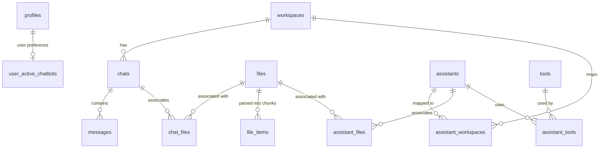

# Database Schema Documentation

This document provides a comprehensive specification of the Supabase PostgreSQL database schema for the chatbot application, detailing all tables, fields, relationships, and database functions.

---

## Entity-Relationship (ER) Summary

The database uses a modular structure centered around the **workspace** concept. Almost all user creations (chats, assistants, prompts, models, files, tools) can be grouped, shared, or isolated using workspace-specific mapping tables (many-to-many relationships).

---

## Detailed Table Reference

### 1. User & Account Management

#### `profiles`
Holds detailed user preferences, onboarded status, API keys, and model parameters.
* **`id`** (`string`, PK)
* **`user_id`** (`string`, FK to `auth.users`)
* **`username`** (`string`)
* **`display_name`** (`string`)
* **`email`** (`string` | `null`)
* **`bio`** (`string`)
* **`image_path`** (`string`)
* **`image_url`** (`string`)
* **`has_onboarded`** (`boolean`): Track if onboarding setup is complete.
* **`profile_context`** (`string`): Custom context injected into queries.
* **`use_azure_openai`** (`boolean`)
* **`openai_api_key`**, **`anthropic_api_key`**, **`google_gemini_api_key`**, **`mistral_api_key`**, **`groq_api_key`**, **`perplexity_api_key`**, **`openrouter_api_key`** (`string` | `null`)
* **`azure_openai_endpoint`**, **`azure_openai_api_key`**, **`azure_openai_embeddings_id`**, **`azure_openai_35_turbo_id`**, **`azure_openai_45_turbo_id`**, **`azure_openai_45_vision_id`** (`string` | `null`)

#### `user_active_chatbots`
Tracks the user's active chatbot preference across login sessions.
* **`user_id`** (`string`, PK, FK to `auth.users`)
* **`active_chatbot_id`** (`string`): The selected chatbot ID (or `"None"` for Default Chat).
* **`created_at`** (`string`)
* **`updated_at`** (`string` | `null`)

#### `api_tokens`
Allows users to manage API authentication tokens.
* **`id`** (`string`, PK)
* **`user_id`** (`string`, FK to `auth.users`)
* **`name`** (`string`)
* **`token_hash`** (`string`)
* **`token_preview`** (`string`)
* **`created_on`** (`string`)

---

### 2. Workspace & Organization

#### `workspaces`
Represents the structural home boundaries for a user's chats and setups.
* **`id`** (`string`, PK)
* **`user_id`** (`string`, FK to `auth.users`)
* **`name`** (`string`)
* **`description`** (`string`)
* **`instructions`** (`string`)
* **`is_home`** (`boolean`): If it is the default home workspace.
* **`sharing`** (`string`)
* **`image_path`** (`string`)
* **`default_model`** (`string`)
* **`default_prompt`** (`string`)
* **`default_temperature`** (`number`)
* **`default_context_length`** (`number`)
* **`embeddings_provider`** (`string`)
* **`include_profile_context`** (`boolean`)
* **`include_workspace_instructions`** (`boolean`)

---

### 3. Chats & Messaging

#### `chats`
Represents an individual chat session inside a workspace.
* **`id`** (`string`, PK)
* **`user_id`** (`string`, FK to `auth.users`)
* **`workspace_id`** (`string`, FK to `workspaces`)
* **`folder_id`** (`string` | `null`, FK to `folders`)
* **`assistant_id`** (`string` | `null`, FK to `assistants`)
* **`chatbot_id`** (`string` | `null`)
* **`name`** (`string`)
* **`model`** (`string`)
* **`prompt`** (`string`)
* **`temperature`** (`number`)
* **`context_length`** (`number`)
* **`embeddings_provider`** (`string`)
* **`include_profile_context`** (`boolean`)
* **`include_workspace_instructions`** (`boolean`)
* **`sharing`** (`string`)

#### `messages`
Individual prompt or completion messages in a chat.
* **`id`** (`string`, PK)
* **`user_id`** (`string`, FK to `auth.users`)
* **`chat_id`** (`string`, FK to `chats`)
* **`assistant_id`** (`string` | `null`, FK to `assistants`)
* **`role`** (`string`): e.g. `"user"`, `"assistant"`.
* **`content`** (`string`)
* **`model`** (`string`)
* **`sequence_number`** (`number`): Ordering of the message in the conversation thread.
* **`image_paths`** (`string[]`)
* **`feedback`** (`string` | `null`)

#### `chatbot_chats`
Relates specific chatbots to chat logs.
* **`chat_id`** (`string`, PK, FK to `chats`)
* **`chatbot_id`** (`string`, PK)
* **`workspace_id`** (`string`, FK to `workspaces`)
* **`chatbot_name`** (`string` | `null`)
* **`user_id`** (`string`, FK to `auth.users`)

---

### 4. Files & Knowledge (RAG)

#### `files`
Uploaded files before indexing or chunking.
* **`id`** (`string`, PK)
* **`user_id`** (`string`, FK to `auth.users`)
* **`folder_id`** (`string` | `null`, FK to `folders`)
* **`name`** (`string`)
* **`description`** (`string`)
* **`file_path`** (`string`)
* **`size`** (`number`)
* **`type`** (`string`)
* **`tokens`** (`number`)
* **`sharing`** (`string`)

#### `file_items`
Chunked text fragments from files, ready for vector retrieval.
* **`id`** (`string`, PK)
* **`user_id`** (`string`, FK to `auth.users`)
* **`file_id`** (`string`, FK to `files`)
* **`content`** (`string`)
* **`tokens`** (`number`)
* **`openai_embedding`** (`string` | `null`): Vector embeddings for OpenAI queries.
* **`local_embedding`** (`string` | `null`): Vector embeddings for local model queries.
* **`sharing`** (`string`)

#### `collections`
Groups of files categorized together.
* **`id`** (`string`, PK)
* **`user_id`** (`string`, FK to `auth.users`)
* **`folder_id`** (`string` | `null`, FK to `folders`)
* **`name`** (`string`)
* **`description`** (`string`)
* **`sharing`** (`string`)

#### `folders`
Organizes collections, files, chats, prompts, models, etc.
* **`id`** (`string`, PK)
* **`user_id`** (`string`, FK to `auth.users`)
* **`workspace_id`** (`string`, FK to `workspaces`)
* **`name`** (`string`)
* **`type`** (`string`): e.g. `"chats"`, `"files"`, `"prompts"`.

---

### 5. Custom Tools & Custom Assistants

#### `assistants`
Defines configured custom agents.
* **`id`** (`string`, PK)
* **`user_id`** (`string`, FK to `auth.users`)
* **`folder_id`** (`string` | `null`, FK to `folders`)
* **`name`** (`string`)
* **`description`** (`string`)
* **`image_path`** (`string`)
* **`prompt`** (`string`)
* **`model`** (`string`)
* **`temperature`** (`number`)
* **`context_length`** (`number`)
* **`embeddings_provider`** (`string`)
* **`include_profile_context`** (`boolean`)
* **`include_workspace_instructions`** (`boolean`)
* **`sharing`** (`string`)

#### `tools`
External API tools that assistants can execute.
* **`id`** (`string`, PK)
* **`user_id`** (`string`, FK to `auth.users`)
* **`folder_id`** (`string` | `null`, FK to `folders`)
* **`name`** (`string`)
* **`description`** (`string`)
* **`url`** (`string`)
* **`schema`** (`Json`)
* **`custom_headers`** (`Json`)
* **`sharing`** (`string`)

---

### 6. Relational Many-to-Many Mapping Tables
These tables map custom assets to various workspaces:
* **`assistant_workspaces`**: Links assistants to workspaces.
* **`assistant_collections`**: Links collections to assistants.
* **`assistant_files`**: Links files to assistants.
* **`assistant_tools`**: Links tools to assistants.
* **`collection_workspaces`**: Links collections to workspaces.
* **`collection_files`**: Links files to collections.
* **`chat_files`**: Links files to chats.
* **`message_file_items`**: Links file items (chunks) used during query completion to messages (citations).
* **`file_workspaces`**: Links files to workspaces.
* **`model_workspaces`**: Links custom models to workspaces.
* **`preset_workspaces`**: Links presets to workspaces.
* **`prompt_workspaces`**: Links prompts to workspaces.
* **`tool_workspaces`**: Links custom tools to workspaces.

---

### 7. Issue & Feedback Tracker

#### `issues`
System issue reporting system.
* **`issue_id`** (`string`, PK)
* **`title`** (`string`)
* **`description`** (`string` | `null`)
* **`status`** (`string` | `null`)
* **`created_by`** (`string`, FK to `auth.users`)
* **`created_at`** (`string` | `null`)
* **`updated_at`** (`string` | `null`)

#### `comments`
Comments left on reports.
* **`comment_id`** (`string`, PK)
* **`issue_id`** (`string` | `null`, FK to `issues`)
* **`comment`** (`string`)
* **`created_by`** (`string`, FK to `auth.users`)
* **`created_at`** (`string` | `null`)

#### `issue_likes`
Likes counter for issues.
* **`issue_id`** (`string`, FK to `issues`)
* **`user_id`** (`string`, FK to `auth.users`)

---

## Custom Database Functions (Stored Procedures)

1. **`match_file_items_local`** & **`match_file_items_openai`**:
   * **Args**: `query_embedding` (`string`), `similarity_threshold` (`number`), `match_count` (`number`), `file_ids` (`string[]`)
   * **Purpose**: Performs cosine similarity search over chunked vector embeddings to power RAG (Retrieval-Augmented Generation).
2. **`delete_messages_including_and_after`**:
   * **Args**: `p_chat_id` (`string`), `p_sequence_number` (`number`), `p_user_id` (`string`)
   * **Purpose**: Used during regenerations to remove all messages starting from a specific point.
