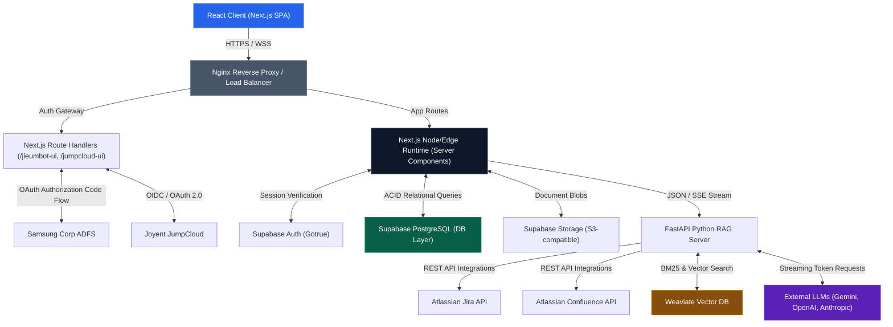
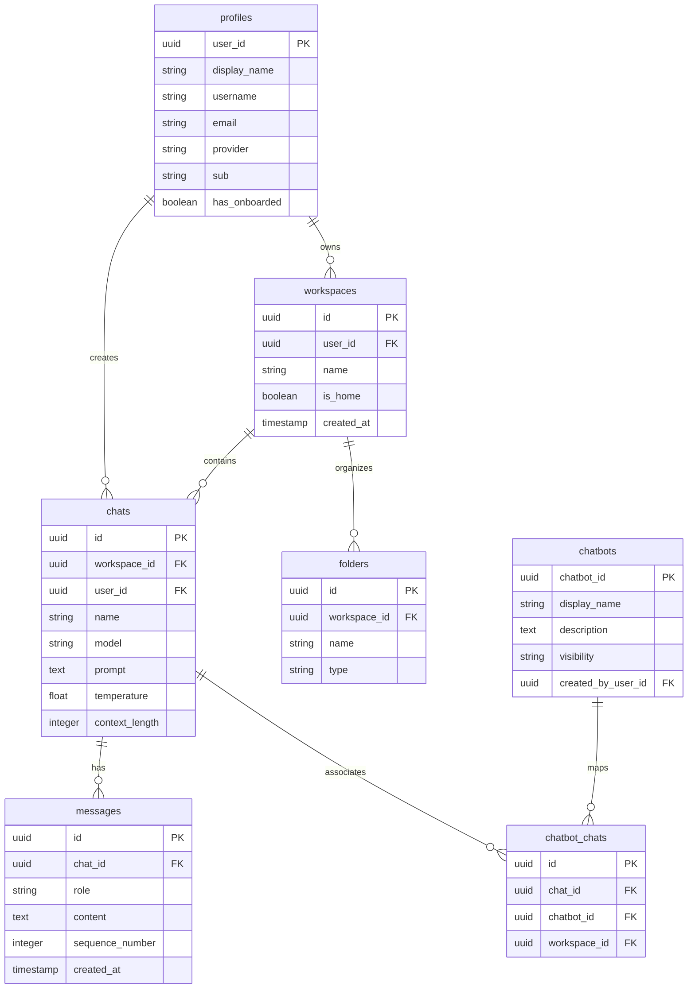

# Jieum Chat - System Architecture & Engineering Spec

## 1. Executive Summary & Core Value Proposition

Jieum Chat is an enterprise-grade, multi-tenant Conversational AI and Retrieval-Augmented Generation (RAG) platform. The system is designed to securely bridge public/private Large Language Models (LLMs) with proprietary corporate knowledge bases (including Confluence, Jira, and uploaded document corpuses) under strict data-access permissions. 

### Key Technical Challenges Solved
1. **SSO Federation & Serverless Session Sync**: Unifying legacy ADFS (Samsung Corp AD) and modern cloud Identity Providers (JumpCloud OAuth 2.0) with Supabase's serverless authentication model. This is achieved using route-level ticket exchanging, admin magic-link validation, and secure session cookie sync.
2. **Multi-Tenant Isolation**: Ensuring strict data isolation across dynamic corporate workspaces. Information boundary controls are enforced at both the PostgreSQL relational layer and Weaviate's vector search level.
3. **Real-Time Token Streaming**: Implementing low-latency, end-to-end streaming of LLM tokens over chunked HTTP Transfer Encoding (Server-Sent Events) from remote APIs, through Next.js route handlers, down to React markdown renderers.
4. **Context-Aware Citation Verification**: Resolving inline chatbot text references (`text://` links) back to original file chunks. Document access boundaries are verified dynamically before launching interactive modals.

---

## 2. End-to-End System Flow Diagram

---

## 3. Core Features & Deep-Dive Component Breakdown

### Feature A: Federated SSO & Workspace Routing Hook
- **Description**: Exchanging authentication codes from ADFS / JumpCloud to authorize user sessions in Supabase, dynamically configuring active workspaces, and launching landing chatbot assets.
- **Ingress Path**: User visits `/login` -> Clicks SSO -> Redirected to Identity Provider (IdP) -> Callback redirects to `/jieum-ui/login/redirect` or `/jieum-ui/login/jumpcloud/redirect` with Auth code.
- **Execution Steps**:
  1. Route handler exchanges code with the IdP endpoint for an ID token.
  2. The server decodes JWT claims (`upn`, `sub`, `email`) and checks the Supabase `profiles` database.
  3. If a new user is detected, a profile is auto-provisioned. The Supabase Admin client generates a one-time OTP magic link.
  4. The handler calls `supabase.auth.verifyOtp` to establish a verified session and sets session cookies (`sb-access-token`, `sb-refresh-token`).
  5. The server queries the database for the user's `home_workspace` ID.
- **Egress Path**: Server responds with a redirect response (`NextResponse.redirect`) forcing the client to land directly on the default chatbot page: `/[workspaceid]/chatbot/97e308c2-6048-4b7b-ad4b-ba84060f0e7a`.

### Feature B: Hybrid Retrieval-Augmented Generation (RAG) Loop
- **Description**: User submits a natural language question inside an active chat session. The system fetches context across vector search and external Atlassian integrations to augment LLM completions.
- **Ingress Path**: `ChatInput` fires a REST POST request to Next.js route handler (`/api/chat/[provider]`).
- **Execution Steps**:
  1. Next.js server validates the session token and fetches the configuration schema of the selected chatbot.
  2. Next.js triggers the Python RAG backend (`/api/query`), forwarding the conversation history, user query, and source files.
  3. The RAG service performs a hybrid search (Dense Vector Embeddings + BM25 keyword matching) against the document chunks stored in Weaviate.
  4. Concurrently, if Jira or Confluence integrations are enabled, it polls live tickets or spaces using the user's authenticated PAT (Personal Access Token).
  5. Context chunks are merged, filtered via a cross-encoder re-ranking model, and formatted into system prompts.
  6. The prompt is forwarded to the LLM (e.g. Gemini or GPT-4) requesting streaming completion.
- **Egress Path**: The LLM streams raw chunks back to the FastAPI RAG server, which passes them to the Next.js runtime. Next.js uses standard Server-Sent Events (SSE) to push updates to the React client, dynamically updating the DOM.

### Feature C: Interactive Modal Citation Resolver
- **Description**: Resolves custom text citation links (`text://document-id`) embedded within chatbot responses into readable source documents with full text-wrapping.
- **Ingress Path**: React markdown renderer intercepts clicks on links prefixed with `text://`.
- **Execution Steps**:
  1. Link parameters are parsed to extract the target document ID.
  2. The client context triggers a state update opening the `View Document` modal window.
  3. The modal performs a fetch request to the endpoint `/api/data-sources-api/[document-id]`.
  4. The Next.js API route checks the active user's workspace permissions in Supabase.
  5. If authenticated and permitted, the database returns the file path, and the server fetches raw document data from Supabase Storage.
  6. Content is formatted into markdown or plain text with explicit CSS styling rules (`whitespace-pre-wrap`, `break-words`).
- **Egress Path**: Renders the document overlay inside the viewport, allowing users to scroll and read the document source without losing their chat context.

---

## 4. Database Storage & Schema Diagram

### Storage Strategy
- **Supabase PostgreSQL**: Acts as the primary transactional datastore. Chosen for relational integrity, row-level security (RLS) policies, and performance when querying user profiles, active workspaces, and session metadata.
- **Weaviate**: Serves as the vector search index. Chosen for its native support of hybrid queries (combining BM25 text indices with HNSW vector indices) and tenant-level routing schemas.
- **Supabase Storage**: Object storage (S3-compatible) used for document uploads (PDFs, DOCX, TXT) and chatbot assets.

### Schema Design (Mermaid ERD)

---

## 5. Advanced Backend Concepts & Patterns Applied

### Concurrency & Parallelism
- **Next.js & Node Runtime**: Leverages Node's single-threaded event loop with non-blocking I/O. For heavy operations (like PDF parsing or token processing), the system hands off execution to microtasks and background workers.
- **FastAPI (Python)**: Utilizes `async/await` syntax powered by Uvicorn. Network requests (polling Jira, Confluence, and Weaviate) are multiplexed concurrently using `asyncio.gather()`, ensuring that one slow external API does not block incoming chatbot queries.

### Data Consistency
- **ACID Boundaries**: Chat metadata updates, folders, and workspace associations are wrapped in database transactions (`pg` layer). If creating a chat or associating it with a chatbot fails, the entire transaction is rolled back.
- **Eventual Consistency in RAG**: Document uploads trigger an asynchronous task. The document metadata is written immediately to PostgreSQL, while a background queue handles the extraction, chunking, and embedding generation. Once the vectors are successfully indexed in Weaviate, the document state transitions to `processed`.

### Communication Patterns
- **Synchronous REST APIs**: Used for control-plane tasks (creating chats, switching workspaces, updating user profiles, fetching configuration keys).
- **Asynchronous Event Streaming**: Core chat operations utilize Server-Sent Events (SSE). The Python RAG server streams tokens immediately to Next.js using a `StreamingResponse`, which Next.js forwards directly to the browser client via a `ReadableStream`.

### Caching Stratagem
- **Cache-Aside Pattern**: Frequently accessed configurations, chatbot metadata, and public system prompts are cached in memory (client-side context state) or intermediate Redis instances.
- **Stampede / Penetration Mitigation**: Missing keys are protected using mutex-locking patterns or brief debouncing, preventing multiple duplicate queries from hitting the database simultaneously (Cache Stampede).

### Resilience Patterns
- **Rate-Limiting**: The application implements bucket-token algorithms at the Next.js middleware and load balancer layers to prevent API abuse.
- **Abort Controllers**: The client mounts an `AbortController` instance for every streaming completion. If the user switches routes or deletes a chat session mid-completion, the stream is canceled immediately, freeing backend server connections.
- **Retry Policies**: Failed connections to third-party LLMs or vector databases are handled via exponential backoff algorithms (retrying after $2^n$ seconds with jitter).

---

## 6. Technical Interview "Pitch" Scripts

### The 60-Second "Elevator Pitch"
> "I work on Jieum Chat, an enterprise-grade conversational AI platform that connects corporate employees with LLMs and internal data sources. Architecturally, we use Next.js on the frontend and FastAPI on the backend. The platform integrates corporate SSO providers like ADFS and JumpCloud to establish secure, serverless sessions via Supabase. We solve the multi-tenant RAG challenge by storing structured user metadata in a relational PostgreSQL database and high-dimensional document vectors in Weaviate, allowing users to query Jira, Confluence, and private documents with strict security. My specific work focused on building out the SSO callback handlers, designing the post-login routing mechanisms, and building the responsive, layout-safe document viewer."

### The 3-Minute Deep Dive
> "To understand the architecture under the hood, let’s trace a user query from the moment they submit a question.
> 
> When the user types a message and clicks send, the React client updates its local state context and triggers a POST request to our Next.js route handlers. The API route verifies the session cookies using Supabase Auth. Once verified, it passes the query, chat history, and workspace settings to our Python RAG server running FastAPI.
> 
> The FastAPI service initiates a parallel retrieval pipeline using Python's `asyncio`. It concurrently queries Weaviate to execute a hybrid search, which uses BM25 keyword search alongside vector cosine similarity to retrieve relevant document chunks, while also polling live workspaces from Jira and Confluence if configured. 
> 
> Once these chunks are retrieved, they are processed through a re-ranking pipeline. We construct a dynamic prompt context that is sent to the LLM. Rather than waiting for the entire LLM response, the API returns a stream using chunked transfer encoding. Next.js intercepts this stream and proxies it down to the React client using a ReadableStream. The client's React Markdown component renders the text tokens in real-time, including any `text://` citation annotations.
> 
> In terms of trade-offs, we separated the Next.js frontend from the FastAPI Python backend to allow us to scale them independently. We offload heavy vector math and ETL document processing to Python while Next.js handles server-side page routing, user sessions, and low-latency API proxying. This guarantees a responsive, secure experience even when backend operations are processing massive volumes of concurrent data."
