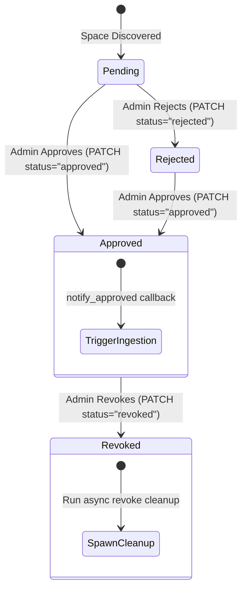

# Jieumchat Administrative Approval Specification

This document details the administrative review, status transitions, database updates, and asynchronous cleanup routines managed by `admin_ops.py` for crawled data sources.

---

## 1. Approval State Machine & Transitions

When external Atlassian org spaces (Jira projects or Confluence spaces) are discovered, they enter a review pipeline. The diagram below shows the allowed status transitions for a data source:



---

## 2. API Endpoint Implementations

The following endpoints are routed through the `Admin Data Sources` controller:

### 2.1. GET `/admin/data-sources`
*   **Function**: Lists discovered data sources awaiting approval, with query-based filters for `crawl_approval_status`, `org`, `type`, and `resource_id`.
*   **Pagination**: Uses offset-based pagination (`offset`, `limit`).
*   **Scope Resolution**: Checks `AccessGrantRepo` for `__PUBLIC__` to return the source scope (`public` or `private`).

### 2.2. PATCH `/admin/data-sources/{data_source_id}`
*   **Request Body**: `{ "crawl_approval_status": "approved" | "rejected" | "revoked" }`
*   **Function**: Transitions the source status and triggers the corresponding background tasks.

### 2.3. POST `/admin/approve-all-data-sources`
*   **Function**: Bulk-approves all pending data sources associated with a user in a single request.

---

## 3. Core Operational Logic

### 3.1. Approval Execution (`approve`)
1.  **Validation**: Verifies the current status transition is valid (using the `validate_transition` domain helper).
2.  **Database Update**: Updates `crawl_approval_status = 'approved'` in the `data_source_config` PostgreSQL table.
3.  **Sync Trigger**: Fires the `_notify_approved` callback. This notifies the scheduler dispatcher to immediately run space discovery, download pages, and index them into Weaviate.

### 3.2. Revocation & Cleanup (`revoke`)
Revocation is a kill-switch that removes a data source and its vectors. Because cleaning up large indexes is slow, the system splits the task into synchronous and asynchronous phases:

1.  **Synchronous Phase**:
    *   Updates `crawl_approval_status = 'revoked'` in PostgreSQL. The UI receives an immediate response showing the source is revoked.
2.  **Asynchronous Phase** (`_spawn_revoke_cleanup`):
    *   Spawns a fire-and-forget background task using `asyncio.create_task` to run the following cleanup operations concurrently via `asyncio.gather()`:

```python
# Concurrently clean up all assets linked to the revoked data source
await asyncio.gather(
    self._doc_repo.delete_by_data_source(data_source_id),     # Delete Weaviate vectors
    self._ds_repo.init_job_counts(data_source_id),            # Reset document counters in DB
    self._grants.delete_for_data_source(data_source_id),       # Delete sharing permissions
    self._user_enabled.delete_for_data_source(data_source_id),# Disable from user search lists
    self._collections.delete_for_data_source(data_source_id), # Delete sync watermark offsets
)
```

---

## 4. Interview Pitch Script

If an interviewer asks you: **"How did you design a background deletion pipeline to clean up large vector datasets without slowing down your API?"**

> *"In our RAG pipeline, when an administrator revokes access to a Jira or Confluence space, we need to immediately prevent users from searching it, and then clean up the database. 
> 
> To do this without blocking the API thread, we split the revocation into two phases. First, we update the database status to 'revoked' synchronously, so the UI updates immediately and the search engine knows to ignore the resource. 
> 
> Second, we spawn an asynchronous, fire-and-forget background task using Python's `asyncio` to handle the heavy cleanup. This task runs parallel database operations to purge related vector chunks from Weaviate, delete user sharing permissions, and reset sync counters in PostgreSQL. This keeps our API responsive while ensuring our database remains clean."*
