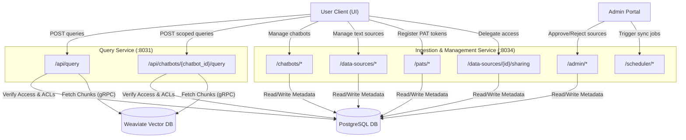

# Jieumchat API Specification Reference

This document catalogs and explains the endpoints, parameter payloads, and authentication boundaries of the **Jieumchat** system. The system divides APIs across two gateway services:

1.  **Query Handler Service (Port `:8031`)**: Orchestrates LLM reasoning, document retrieval, and SSE stream response generation.
2.  **Data Collection & Management Service (Port `:8034`)**: Administers data sources, sharing permissions, personal access tokens (PATs), and scheduled sync jobs.

---

## 1. API Routing Architecture Diagram

The diagram below illustrates how client applications (User UI and Admin Portal) interact with the gateway routes, indicating database lookups and streaming responses.



---

## 2. Global Headers & Authentication

All user-facing endpoints expect authentication headers injected by the ingress gateway:

*   `x-user-id` (`string`, **Required**): The unique identifier of the calling user (e.g. `bk21.choi`).
*   `Content-Type`: `application/json` (except for query streaming endpoints, which return `text/event-stream`).

---

## 3. Endpoint Reference

### 3.1. Query Handler API (Port `:8031`)

Endpoints designed for retrieval-augmented generation. Responses are streamed as Server-Sent Events (SSE).

#### 1. POST `/api/query`
Streams general, cross-datasource search answers.
*   **Function**: Rewrites the user query using Qwen3, runs the RAG agent loop to select appropriate tools, executes vector and keyword searches, reranks candidate chunks, and streams the formatted answer via Server-Sent Events.
*   **PostgreSQL Interaction**:
    *   *Read*: Queries `data_source_access_grants` (for public and user-specific scopes) and joins with `user_enabled_data_sources` to resolve the set of authorized `data_source_uuid`s for the user ID in `x-user-id`.
    *   *Write*: Inserts the finalized question, generated answer, and request metadata into the `feedback` table for analytics and tracing.
*   **Weaviate Interaction**:
    *   *Read*: The agent's `hybrid_search` tool queries the Weaviate `UNIFIED_SCHEMA` collection, applying an injected filter restricting matches to the authorized `data_source_uuid` list. It also queries `RECORD_SCHEMA` to retrieve full document contexts when necessary.
*   **Request Body**:
    ```json
    {
      "query": "What is the status of the Samsung SSO project?",
      "chat_id": "conv-uuid-9999",
      "conversation_history": [
        {"role": "user", "content": "Hi"},
        {"role": "assistant", "content": "How can I help you?"}
      ]
    }
    ```
*   **Response**: `text/event-stream` returning data chunks:
    *   `event: reaction` (e.g. `mag` searching, `eyes` analyzing).
    *   `event: text` (incremental token string).
    *   `event: citations` (JSON array of sources used).
    *   `event: end` (close connection marker).

#### 2. POST `/api/chatbots/{chatbot_id}/query`
Streams answers scoped strictly to the data sources linked to a specific chatbot configuration.
*   **Function**: Executes a RAG query restricted to the knowledge bounds defined in a shared chatbot bundle.
*   **PostgreSQL Interaction**:
    *   *Read*: Queries `chatbot_config` to retrieve chatbot metadata. Verifies permissions (checks ownership or queries `chatbot_user_access` to confirm the caller is on the allow-list). If authorized, queries `chatbot_data_sources` to retrieve linked `data_source_uuid`s and intersects this with active selections in `user_enabled_data_sources`.
    *   *Write*: Logs query metrics and output telemetry into the `feedback` table.
*   **Weaviate Interaction**:
    *   *Read*: Runs dense and sparse searches on Weaviate `UNIFIED_SCHEMA` and `RECORD_SCHEMA` collections, applying an injected filter matching only the chatbot's linked `data_source_uuid`s.
*   **URL Path Parameter**:
    *   `chatbot_id` (`string`): The UUID of the chatbot.
*   **Request Body**: Same structure as `/api/query`.

---

### 3.2. Chatbot Configuration API (Port `:8034` / `/chatbots`)

Enables users to manage, bundle, and share customized chatbot configurations.

#### 1. POST `/chatbots`
Creates a new chatbot configuration profile.
*   **Function**: Registers a new custom chatbot config and links it to a collection of data sources.
*   **PostgreSQL Interaction**:
    *   *Write*: Inserts a new configuration row into `chatbot_config` (sets `chatbot_id`, `display_name`, `description`, `visibility`, and `created_by_user_id`). Inserts mapping rows into the `chatbot_data_sources` junction table for each UUID in `data_source_uuids`.
*   **Weaviate Interaction**: None.
*   **Request Body**:
    ```json
    {
      "display_name": "Jira Assistant",
      "description": "Searches Jira tickets across MX spaces",
      "visibility": "private",
      "data_source_uuids": ["ds-uuid-1111", "ds-uuid-2222"]
    }
    ```
*   **Response** (`200 OK`): Returns the created chatbot model including its `chatbot_id`.

#### 2. GET `/chatbots`
Lists chatbots visible to the caller.
*   **Function**: Returns chatbot configurations the user is allowed to view, categorized by ownership.
*   **PostgreSQL Interaction**:
    *   *Read*: Performs a query combining chatbots owned by the user (`created_by_user_id = user_id`), marked public (`visibility = 'public'`), or shared with them (`chatbot_id` matches user's ID in `chatbot_user_access`). Joins with `chatbot_data_sources` to retrieve linked data source counts and IDs.
*   **Weaviate Interaction**: None.
*   **Query Parameters**:
    *   `limit` (`int`, default `20`): Page size.
    *   `offset` (`int`, default `0`): Page offset.

#### 3. GET `/chatbots/{chatbot_id}`
Retrieves configuration details of a single chatbot.
*   **Function**: Fetches complete metadata, allowed users, and data sources for a chatbot.
*   **PostgreSQL Interaction**:
    *   *Read*: Queries `chatbot_config` by `chatbot_id` and checks visibility rules. If authorized, queries `chatbot_data_sources` and `chatbot_user_access` to return linked mappings.
*   **Weaviate Interaction**: None.

#### 4. PATCH `/chatbots/{chatbot_id}`
Updates an existing chatbot's metadata or data source mappings.
*   **Function**: Updates chatbot configurations and data source selections.
*   **PostgreSQL Interaction**:
    *   *Write*: Updates the metadata columns (`display_name`, `description`, `visibility`) in `chatbot_config`. If `data_source_uuids` are changed, deletes existing records in `chatbot_data_sources` and inserts the new list.
*   **Weaviate Interaction**: None.

#### 5. DELETE `/chatbots/{chatbot_id}`
Deletes the chatbot configuration.
*   **Function**: Removes a chatbot and its associated configuration mappings.
*   **PostgreSQL Interaction**:
    *   *Write*: Deletes the matching row from `chatbot_config`. Cascading foreign keys delete related records in `chatbot_data_sources` and `chatbot_user_access` automatically.
*   **Weaviate Interaction**: None.

#### 6. GET `/chatbots/data-source-picker`
Lists all approved and active data sources the caller has access to, enabling them to construct or update chatbot bundles.
*   **Function**: Returns data sources available to be added to a chatbot.
*   **PostgreSQL Interaction**:
    *   *Read*: Queries `data_source_config` joined with `data_source_access_grants` to return approved data sources that the user owns or has access to.
*   **Weaviate Interaction**: None.

---

### 3.3. User Data Sources API (Port `:8034` / `/data-sources`)

Manages source configurations and documents uploaded directly by users.

#### 1. GET `/data-sources`
Lists all data sources the caller is authorized to view.
*   **Function**: Returns data sources available to the user based on direct or public grants.
*   **PostgreSQL Interaction**:
    *   *Read*: Queries `data_source_config` joined with `data_source_access_grants` (matching the user's ID or the `'__PUBLIC__'` principal). Left-joins with `user_enabled_data_sources` to include the user's search enablement status.
*   **Weaviate Interaction**: None.

#### 2. POST `/data-sources`
Creates a manual, local text data source.
*   **Function**: Registers a new local text data source and queues its documents for indexing.
*   **PostgreSQL Interaction**:
    *   *Write*:
       1. Inserts a configuration row into `data_source_config` (sets `source_type = 'text'`, `scope = 'private'`, and status to `'approved'`).
       2. Inserts an owner grant row into `data_source_access_grants` (`grant_source = 'self'`).
       3. Inserts document rows into `data_source_documents` with `index_status = 'queued'`.
*   **Weaviate Interaction**:
    *   *Write*: Triggers background worker processes to split document text into chunks, generate embeddings, and write records to Weaviate `UNIFIED_SCHEMA` and `RECORD_SCHEMA` collections.
*   **Request Body**:
    ```json
    {
      "type": "text",
      "resource_id": "PROJECT_CHUNKS",
      "documents": [
        {
          "title": "Setup Guide",
          "body": "This document outlines...",
          "content_format": "markdown"
        }
      ]
    }
    ```

#### 3. PATCH `/data-sources/{data_source_id}`
Updates a data source configuration.
*   **Function**: Renames a data source or toggles its search status.
*   **PostgreSQL Interaction**:
    *   *Write*: Updates `resource_id` and `normalized_resource_id` in `data_source_config`. If search status is changed (`enabled`/`disabled`), inserts or deletes a mapping row in `user_enabled_data_sources`.
*   **Weaviate Interaction**: None.

#### 4. DELETE `/data-sources/{data_source_id}`
Deletes a local text data source.
*   **Function**: Removes a text data source and deletes its files and vectors.
*   **PostgreSQL Interaction**:
    *   *Write*: Deletes the matching row from `data_source_config`. Cascading foreign keys delete related records in `data_source_access_grants`, `user_enabled_data_sources`, and `data_source_documents` automatically.
*   **Weaviate Interaction**:
    *   *Write*: Triggers a deletion job that calls Weaviate's `DeleteFilter` on the collections (`UNIFIED_SCHEMA`, `RECORD_SCHEMA`, `ENTITY_SCHEMA`) matching the `data_source_uuid` to purge all associated vector chunks.

#### 5. GET `/data-sources/{data_source_id}/documents`
Lists all manual text documents uploaded to a local data source.
*   **Function**: Returns document metadata for a local text source.
*   **PostgreSQL Interaction**:
    *   *Read*: Queries `data_source_documents` where `data_source_uuid = data_source_id`.
*   **Weaviate Interaction**: None.

#### 6. POST `/data-sources/{data_source_id}/documents`
Adds a new text document to the source.
*   **Function**: Uploads a text document and queues it for vector indexing.
*   **PostgreSQL Interaction**:
    *   *Write*: Inserts a new row into `data_source_documents` with `index_status = 'queued'`. The background worker later updates `index_status` to `'available'` or `'failed'`.
*   **Weaviate Interaction**:
    *   *Write*: The background process generates vector embeddings and writes them to the Weaviate `UNIFIED_SCHEMA` and `RECORD_SCHEMA` collections.

#### 7. GET `/data-sources/{data_source_id}/documents/{document_id}`
Fetches the raw title, body, and format of a text document.
*   **Function**: Returns document text and details.
*   **PostgreSQL Interaction**:
    *   *Read*: Queries `data_source_documents` where `id = document_id` and `data_source_uuid = data_source_id`.
*   **Weaviate Interaction**: None.

#### 8. PATCH `/data-sources/{data_source_id}/documents/{document_id}`
Updates text document contents.
*   **Function**: Updates document contents and updates its vector index.
*   **PostgreSQL Interaction**:
    *   *Write*: Updates the title and body columns in `data_source_documents` and resets `index_status = 'queued'`.
*   **Weaviate Interaction**:
    *   *Write*: The background process updates the vector store by writing the new chunks and deleting the old vector records in Weaviate using a filter on `document_id`.

---

### 3.4. Personal Access Token (PAT) API (Port `:8034` / `/pats`)

Handles credentials used to connect and scan external Atlassian instances.

#### 1. POST `/pats`
Registers a new crawler access token for the caller.
*   **Function**: Saves Atlassian PAT credentials and triggers a background sync job.
*   **PostgreSQL Interaction**:
    *   *Write*: Upserts a row into the `user_pat` table (sets `user_id`, `org`, `source_type`, `token`, `is_valid = True`, and `initial_sync_status = 'pending'`).
*   **Weaviate Interaction**: None (The triggered background sync job will later perform writes to Weaviate).

#### 2. GET `/pats`
Lists PAT credentials registered by the caller.
*   **Function**: Returns the user's PAT credentials and their sync status.
*   **PostgreSQL Interaction**:
    *   *Read*: Queries `user_pat` where `user_id = user_id`.
*   **Weaviate Interaction**: None.

#### 3. DELETE `/pats/{org}/{source_type}`
Removes the calling user's PAT credentials for a specific organization and connection type.
*   **Function**: Deletes registered Atlassian credentials.
*   **PostgreSQL Interaction**:
    *   *Write*: Deletes the matching row from `user_pat` matching `user_id`, `org`, and `source_type`.
*   **Weaviate Interaction**: None.

#### 4. POST `/pats/{org}/{source_type}/validate`
Triggers an immediate test call to Atlassian APIs to check if the PAT has been revoked or expired.
*   **Function**: Verifies a PAT token's status.
*   **PostgreSQL Interaction**:
    *   *Read*: Reads the token string from `user_pat`.
    *   *Write*: Updates the `is_valid`, `is_valid_checked_at`, and `invalid_reason` columns in `user_pat` based on the validation result.
*   **Weaviate Interaction**: None.

---

### 3.5. Sharing & Permissions API (Port `:8034` / `/data-sources/{id}/sharing`)

Manages access delegation for private data sources.

#### 1. GET `/data-sources/{data_source_id}/sharing`
Lists user access grants for a data source.
*   **Function**: Returns user access grants for a data source.
*   **PostgreSQL Interaction**:
    *   *Read*: Queries `data_source_access_grants` where `data_source_uuid = data_source_id` and `principal_type = 'user'`.
*   **Weaviate Interaction**: None.

#### 2. POST `/data-sources/{data_source_id}/sharing`
Updates data source sharing configurations.
*   **Function**: Grants or revokes access permissions for other users.
*   **PostgreSQL Interaction**:
    *   *Write*: Inserts or deletes rows in `data_source_access_grants` for the specified user IDs.
*   **Weaviate Interaction**: None.

---

### 3.6. Administration API (Port `:8034` / `/admin`)

System administration routes for governance approvals.

#### 1. GET `/admin/data-sources`
Lists discovered data sources awaiting approval.
*   **Function**: Returns discovered projects and spaces.
*   **PostgreSQL Interaction**:
    *   *Read*: Queries `data_source_config` where `crawl_approval_status` matches the requested status parameter.
*   **Weaviate Interaction**: None.

#### 2. PATCH `/admin/data-sources/{data_source_id}`
Approves or rejects a data source.
*   **Function**: Approves a discovered project or space to trigger background indexing.
*   **PostgreSQL Interaction**:
    *   *Write*: Updates the `crawl_approval_status` column to `'approved'` or `'rejected'` in `data_source_config`.
*   **Weaviate Interaction**: None (The background crawler job will later perform writes to Weaviate).

#### 3. POST `/admin/approve-all-data-sources`
Approves all pending discovered data sources.
*   **Function**: Approves all pending spaces/projects in a single operation.
*   **PostgreSQL Interaction**:
    *   *Write*: Updates all rows with `crawl_approval_status = 'pending'` to `'approved'` in `data_source_config`.
*   **Weaviate Interaction**: None.

---

### 3.7. Scheduler API (Port `:8034` / `/scheduler`)

Operational endpoints for orchestrating background synchronization schedules.

#### 1. GET `/scheduler/jobs`
Lists active background jobs managed by the internal `APScheduler` loop.
*   **Function**: Returns background job status and schedules.
*   **PostgreSQL Interaction**: None (reads from the scheduler's memory).
*   **Weaviate Interaction**: None.

#### 2. POST `/scheduler/jobs/{job_id}/trigger`
Manually triggers execution of a specific scheduler job.
*   **Function**: Manually starts a synchronization or discovery job.
*   **PostgreSQL Interaction**:
    *   *Read*: Reads valid credentials from `user_pat` to authenticate with Atlassian APIs.
    *   *Write*: Discovers new spaces or updates sync times in `user_data_source_collections`.
*   **Weaviate Interaction**:
    *   *Write*: The triggered job fetches issues/pages, chunks and embeds the text, and writes records to the `UNIFIED_SCHEMA`, `RECORD_SCHEMA`, and `ENTITY_SCHEMA` collections.

---
