# Jieumchat - System Architecture & Engineering Spec

## 1. Executive Summary & Core Value Proposition

Jieumchat is a production-grade, enterprise-scale Retrieval-Augmented Generation (RAG) system designed to deliver context-aware, source-cited answers to user questions by securely indexing and querying knowledge stored across multiple Atlassian instances (Jira issues and Confluence pages).

The system serves organizations with heterogeneous hosting environments (supporting both Samsung on-premise Data Centers via "MX" and Atlassian Cloud via "Joyent"). It enforces strict, enterprise-grade access control lists (ACLs) dynamically at query time, ensuring users only retrieve information they have explicit permission to access in the source systems.

### Key Technical Challenges Solved
1. **Dynamic Schema Access Control List (ACL) Injection**: Rather than relying on simple metadata filtering post-retrieval, Jieumchat dynamically modifies Weaviate vector queries and raw GraphQL queries at execution time, injecting tenant-specific `data_source_uuid` ACL arrays directly into the search constraints. This prevents privilege escalation and guarantees security at the database engine level.
2. **Two-Tier High-Throughput Sync Pipeline**: To handle tens of thousands of documents across on-premise and cloud APIs under strict Atlassian API rate limits (150 requests/min per PAT), the system decouples change detection from collection. It uses an async collection worker queue and a separate, dedicated multi-process subprocess (`StorageProcess`) containing concurrent `EmbeddingWorker` and `WeaviateWriter` loops.
3. **Multi-PAT Rate Limit Self-Regulation**: A hybrid proactive-reactive throttling system monitors Atlassian `x-ratelimit-remaining` headers to proactively back off (sleep) during periods of high usage, supplemented by reactive exponential backoff on HTTP `429 Too Many Requests` responses.
4. **Agentic Multi-Step Investigation Loop**: Instead of standard single-turn vector retrieval, the query path executes an agentic loop (up to 12 steps) powered by LLM function-calling. The agent can dynamically decide to execute hybrid search, fetch full documents with comment trees, run raw GraphQL lookups, or directly make live Jira/Confluence API queries to verify real-time status.
5. **Context Compaction and Token Budgeting**: The system implements an automatic conversation history compression strategy based on token usage. When prompt tokens exceed a soft threshold of the context window (70%), the system auto-compacts prior turns, preserving long-running multi-turn dialogs.

---

## 2. End-to-End System Flow Diagram

The following Mermaid diagram traces the architectural separation between the **Data Collection Path (Ingestion)** and the **Query Handler Path (Retrieval & Synthesis)**, along with database layers and external Atlassian dependencies.

```mermaid
graph TD
    %% Styling
    classDef client fill:#f9f,stroke:#333,stroke-width:2px;
    classDef gateway fill:#bbf,stroke:#333,stroke-width:2px;
    classDef service fill:#bfb,stroke:#333,stroke-width:2px;
    classDef database fill:#fbb,stroke:#333,stroke-width:2px;
    classDef external fill:#ddd,stroke:#333,stroke-dasharray: 5 5;

    %% Ingress Clients
    U["Frontend Client / User UI"]:::client
    ADM["Admin Portal"]:::client

    subgraph "Query Handler Service (:8031)"
        QH["FastAPI Entry point: query_handler.py"]:::gateway
        QH_Lock["Chat Request Lock Manager"]:::service
        Agent["Agent Orchestrator: run_query_agent"]:::service
        Rewriter["Query Rewriting & Tokenizer"]:::service
        Reranker["Cross-Encoder Reranker: bge-m3"]:::service
        ACL["Schema ACL Registry & Query Injector"]:::service
    end

    subgraph "Data Collection Service (:8034)"
        DC["FastAPI Entry point: collection_main.py"]:::gateway
        Sched["APScheduler Background Jobs"]:::service
        
        subgraph "DDD Application Jobs"
            DiscJob["Discovery Job"]:::service
            PermJob["Permission Sync Job"]:::service
            CollJob["Collection Job: DETECT -> DISPATCH"]:::service
            SyncJob["Initial Sync Job"]:::service
        end
        
        subgraph "Infrastructure Workers"
            CollWorker["Async Collection Worker (16 concurrent)"]:::service
            PatResolver["Live API PAT Resolver"]:::service
        end
    end

    subgraph "Dedicated Storage Subprocess (spawned)"
        SP["StorageProcess Manager"]:::service
        EmbWorker["EmbeddingWorker (8 concurrent)"]:::service
        WeavWriter["WeaviateWriter (8 concurrent)"]:::service
        CounterWorker["CounterWorker"]:::service
    end

    %% Databases
    subgraph "Data Tier"
        PG[("PostgreSQL Database: Metadata & Config")]:::database
        WEAV[("Weaviate Vector DB")]:::database
    end

    %% External Systems
    subgraph "External Integrations"
        JIRA_MX["MX Jira: On-Prem"]:::external
        CONF_MX["MX Confluence: On-Prem"]:::external
        JIRA_JOY["Joyent Jira: Cloud"]:::external
        CONF_JOY["Joyent Confluence: Cloud"]:::external
        LLM["LLM API: Qwen3"]:::external
        EMB_SERV["Nomic Embed Service"]:::external
        LF["Langfuse Tracing Service"]:::external
    end

    %% Relationships - Query Path
    U -->|"POST /api/query or /api/chatbots/{id}/query"| QH
    QH --> QH_Lock
    QH_Lock --> Agent
    Agent -->|"1. Rewrite Query & Extract Keywords"| Rewriter
    Agent -->|"2. Verify Access & Check ACLs"| ACL
    ACL -->|"Read permissions"| PG
    Agent -->|"3. Retrieve chunks / GraphQL"| WEAV
    Agent -->|"4. Re-rank results"| Reranker
    Agent -->|"5. Tool fallback: Live Jira/Confluence Call"| PatResolver
    PatResolver -->|"Retrieve Valid Token"| PG
    PatResolver -->|"Query Live API"| JIRA_MX
    Agent -->|"6. Call LLM for generation"| LLM
    QH -->|"SSE Stream: text/event-stream"| U
    QH -->|"Telemetry & Tracing"| LF

    %% Relationships - Ingestion Path
    ADM -->|"Register PATs & Approve Sources"| DC
    Sched --> DiscJob
    Sched --> PermJob
    Sched --> CollJob
    
    DiscJob -->|"List projects/spaces"| JIRA_MX
    DiscJob -->|"Save DataSource configs"| PG
    PermJob -->|"Sync Confluence accountIds"| PG
    
    CollJob -->|"DETECT: Diff IDs+Versions"| JIRA_MX
    CollJob -->|"DISPATCH: Push Job IDs"| CollWorker
    CollWorker -->|"COLLECT: Fetch Full Doc Markdown"| JIRA_MX
    CollWorker -->|"Push StorageJob to MP Queue"| SP
    
    SP -->|"StorageJob"| EmbWorker
    EmbWorker -->|"Fetch Vectors"| EMB_SERV
    EmbWorker -->|"Push to Async Queue"| WeavWriter
    WeavWriter -->|"Batch Insert Chunks/Records/Entities"| WEAV
    WeavWriter -->|"Notify complete"| CounterWorker
    CounterWorker -->|"Update processed count"| PG
```



---

## 3. Core Features & Deep-Dive Component Breakdown

### Feature A: Two-Tier Incremental Ingestion Pipeline (DETECT → DISPATCH → COLLECT → STORE)
- **Description**: Periodically syncs documents (Jira issues and Confluence pages) from Atlassian instances into the Weaviate vector index. Decouples expensive API pagination and change detection from document download and indexing to prevent memory bottlenecks and handle API rate limits.
- **Ingress Path**: Triggered on a loop (every 60 seconds) by the `APScheduler` inside `collection_main.py` calling `collection_job.py`.
- **Execution Steps**:
  1. **DETECT**: The scheduler initiates change detection. It retrieves the latest IDs and versions/timestamps from the Atlassian APIs (using page tokenization and concurrency limited by `FETCH_IDS_PAGE_CONCURRENCY=4`). It diffs these against the stored documents in PostgreSQL (`data_source_documents`) and Weaviate to find missing, changed, or deleted items.
  2. **DISPATCH**: Identified changed document IDs are grouped and dispatched into `CollectionJob` dataclasses, which are pushed to an async task queue managed by FastAPI.
  3. **COLLECT**: 16 concurrent `CollectionWorker` tasks pull `CollectionJobs` from the queue, fetch the full content (Markdown/JSON) from Jira/Confluence (using throttling to respect the 150 requests/min rate limit), convert the items to `StorageItem` dataclasses, and push them to a `multiprocessing.Queue`.
  4. **STORE**: A standalone spawned OS process (`StorageProcess`) consumes the queue:
     - 8 concurrent `EmbeddingWorker` tasks pull `StorageItems`, split them into chunks based on token length, and fetch embeddings from the Nomic embedding API in batches of 64.
     - The embedded chunks, records, and entities are sent to 8 `WeaviateWriter` workers which write them in batches (up to 1,000) using Weaviate's gRPC batch insertion.
     - A background `CounterWorker` monitors the writes and periodically (every 5 seconds) updates the database statistics (`job_processed_document_count` in PostgreSQL).
- **Egress Path**: PostgreSQL rows are updated, old Weaviate chunks matching the updated document IDs are deleted, and new vector indices are built.

### Feature B: Agentic Investigation-Style Querying (Agent Loop & SSE Streaming)
- **Description**: Processes user natural language questions through a multi-step investigation agent. The agent executes tools to search the database, fetch documents, query live Atlassian APIs, or run structured GraphQL queries, returning source-cited answers streamed in real-time.
- **Ingress Path**: A client POST request lands on `/api/query` or `/api/chatbots/{chatbot_id}/query` in `query_handler.py`.
- **Execution Steps**:
  1. **Session Lock**: The request enters the query handler and obtains a connection from the `asyncpg` pool. The `chat_request_lock_manager` locks the specific `chat_id` to prevent race conditions during multi-turn streams.
  2. **Initialization**: A fresh or restored `InvestigationConversation` is created. If conversation history exists, it is loaded from the `DialogState` store.
  3. **Investigation Loop**: The agent runs a step loop (up to 12 iterations) calling `run_investigation_step`:
     - The LLM receives the prompt with the conversation summary and determines whether it needs more information.
     - If it calls `hybrid_search`, it performs a dual semantic and keyword search in the `UnifiedSchema` Weaviate collection, applying dynamic ACL filters.
     - If it calls `get_document_from_db`, it retrieves the complete document (e.g., Jira issue description) along with its comment tree from the `RecordSchema` collection.
     - If it calls `confluence_api_call` or `jira_api_call`, the system checks `confluence_user_accounts` and `user_pat`, resolves the correct OAuth/PAT token, and fires a live search query directly to Atlassian.
     - Every step sends an intermediate SSE packet to the client (e.g., sending `reaction` updates like `eyes`, `clipboard`, `mag` to reflect the active tool execution).
  4. **Compaction**: Before each step, the prompt size is checked. If it exceeds 70% of the token limit (`SOFT_COMPRESSION_RATIO`), the conversation is compacted.
  5. **Final Answer Synthesis**: Once the agent stops tool calling, it uses the accumulated evidence to write a detailed answer. If the loop terminates without a direct answer, the agent falls back to a final-turn LLM synthesis call.
  6. **Persistence**: The final answer is appended to the conversation history, and the state is saved to PostgreSQL/DialogState.
- **Egress Path**: The response streams back to the user via SSE (`text/event-stream`) ending with a `type: "end"` packet and a `white_check_mark` reaction, alongside trace logging pushed to Langfuse.

### Feature C: Chatbot Sharing & Access Control Delegation
- **Description**: Enables users to create shared "Chatbots" containing curated bundles of data sources. It implements a delegated authorization flow: the owner's credentials (read grants) allow access to the data sources, and the owner can delegate read access to other specified users (via an allow-list) or make the chatbot entirely public.
- **Ingress Path**: Create/Update requests go to `POST/PUT /chatbots` or `GET /chatbots/data-source-picker` in `data_collection/presentation/routers/chatbot.py`. Query requests go to `/api/chatbots/{chatbot_id}/query`.
- **Execution Steps**:
  1. **Validation**: When an owner creates or updates a chatbot, the application layer checks `data_source_access_grants` to verify the owner has a `read` grant on every `data_source_uuid` in the request.
  2. **Configuration**: The configuration is saved atomically in a single PostgreSQL transaction across `chatbot_config`, `chatbot_data_sources` (junction table linking chatbot to data sources), and `chatbot_user_access` (junction table linking allowed users to the chatbot).
  3. **Access Check (Query Time)**: When a query is sent to `/api/chatbots/{chatbot_id}/query`, the handler calls `verify_access` which runs `fetch_access` on `ChatbotRepo`.
     - It returns a boolean indicating access based on the rule: `caller_id == created_by_user_id OR caller_id IN (allowed_user_ids) OR visibility == 'public'`.
     - If authorized, the system retrieves the chatbot's data sources from `chatbot_data_sources`.
  4. **Scope Extraction**: The search scope is set to the list of `data_source_uuids` attached to the chatbot, bypassing the caller's own personal data source mappings.
- **Egress Path**: The system executes the retrieval step with the chatbot-restricted data source array, returning the response safely to the user.

---

## 4. Database Storage & Schema Diagram

### Storage Strategy

The database tier is split into a relational store (**PostgreSQL**) and a vector/NoSQL store (**Weaviate**) to optimize for different data access patterns:

1. **PostgreSQL (Metadata & Access Control)**:
   - *Data*: User configurations, Personal Access Tokens (PATs), explicit access grants, search enablement toggles, and chatbot mapping configurations.
   - *Why*: Relational data requires strict transaction boundaries (ACID), referential integrity (e.g., cascade deletions when a data source is revoked), unique constraints (e.g., one chatbot display name per owner), and low-latency structured index lookups.
   
2. **Weaviate (Vector & Document Store)**:
   - *Data*: Text chunks with vector embeddings, metadata schemas for issues/confluence pages, and entity mappings.
   - *Why*: Supports fast hybrid search (combining dense vector embeddings with BM25 keyword matching) and structured GraphQL queries.
   - *Collections*:
     - `UnifiedSchema` (`UNIFIED_SCHEMA`): Holds document text split into individual overlapping chunks for dense retrieval.
     - `RecordSchema` (`RECORD_SCHEMA`): Stores the primary documents (Jira issues, Confluence pages) and comment child records with structural metadata (created_by, assignee, resolution_seconds, components) to allow the agent to fetch full document bodies and run aggregations.
     - `EntitySchema` (`ENTITY_SCHEMA`): Indexes user accounts, names, and emails synced from Atlassian to enable permission mapping.

### Schema Design (PostgreSQL & Weaviate ERD)

```mermaid
erDiagram
    %% PostgreSQL Relational Schema
    DATA_SOURCE_CONFIG {
        uuid UUID PK
        org TEXT
        source_type TEXT
        resource_id TEXT
        normalized_resource_id TEXT
        crawl_approval_status TEXT
        job_target_document_count INTEGER
        job_processed_document_count INTEGER
        scope TEXT
        owner_user_id TEXT
        created_on TIMESTAMPTZ
        updated_on TIMESTAMPTZ
    }

    USER_PAT {
        user_id TEXT PK
        org TEXT PK
        source_type TEXT PK
        token TEXT
        is_valid BOOLEAN
        is_valid_checked_at TIMESTAMPTZ
        invalid_reason TEXT
        initial_sync_status TEXT
        initial_sync_completed_at TIMESTAMPTZ
        created_on TIMESTAMPTZ
        updated_on TIMESTAMPTZ
    }

    DATA_SOURCE_ACCESS_GRANTS {
        data_source_uuid UUID PK "FK"
        principal_id TEXT PK
        granted_by_user_id TEXT PK
        principal_type TEXT
        grant_source TEXT
        created_on TIMESTAMPTZ
        updated_on TIMESTAMPTZ
    }

    USER_ENABLED_DATA_SOURCES {
        user_id TEXT PK
        data_source_uuid UUID PK "FK"
        created_on TIMESTAMPTZ
        updated_on TIMESTAMPTZ
    }

    USER_DATA_SOURCE_COLLECTIONS {
        user_id TEXT PK
        data_source_uuid UUID PK "FK"
        last_started_at TIMESTAMPTZ
        last_collected_at TIMESTAMPTZ
        created_on TIMESTAMPTZ
        updated_on TIMESTAMPTZ
    }

    CONFLUENCE_USER_ACCOUNTS {
        user_id TEXT PK
        org TEXT PK
        account_id TEXT
        created_on TIMESTAMPTZ
        updated_on TIMESTAMPTZ
    }

    DATA_SOURCE_DOCUMENTS {
        id UUID PK
        data_source_uuid UUID FK
        title TEXT
        body TEXT
        content_format TEXT
        index_status TEXT
        index_error TEXT
        version INTEGER
        created_by TEXT
        updated_by TEXT
        created_on TIMESTAMPTZ
        updated_on TIMESTAMPTZ
    }

    FEEDBACK {
        id BIGSERIAL PK
        req_id TEXT
        user_id TEXT
        user_email TEXT
        question TEXT
        answer TEXT
        feedback TEXT
        langfuse_trace_id TEXT
        created_on TIMESTAMPTZ
        updated_on TIMESTAMPTZ
    }

    CHATBOT_CONFIG {
        chatbot_id UUID PK
        display_name TEXT
        description TEXT
        visibility TEXT
        created_by_user_id TEXT
        created_on TIMESTAMPTZ
        updated_on TIMESTAMPTZ
    }

    CHATBOT_DATA_SOURCES {
        chatbot_id UUID PK "FK"
        data_source_uuid UUID PK "FK"
        created_on TIMESTAMPTZ
    }

    CHATBOT_USER_ACCESS {
        chatbot_id UUID PK "FK"
        user_id TEXT PK
        created_on TIMESTAMPTZ
    }

    %% Weaviate Collections (Represented conceptually to show alignment)
    WEAVIATE_UNIFIED_SCHEMA {
        data_source_uuid UUID
        chunk_index INT
        chunk_text TEXT
        source TEXT
        document_id TEXT
        link TEXT
        title TEXT
        labels TEXT_ARRAY
        person_names TEXT_ARRAY
        vector VEC_1536 "nomic-embed-text-v1-5"
    }

    WEAVIATE_RECORD_SCHEMA {
        data_source_uuid UUID
        source TEXT
        record_id TEXT
        record_type TEXT
        document_id TEXT
        is_primary_record BOOLEAN
        title TEXT
        body_text TEXT
        created_on DATE
        updated_on DATE
        assignee_name TEXT
        components TEXT_ARRAY
        raw_metadata TEXT
    }

    %% PostgreSQL Relationships
    DATA_SOURCE_CONFIG ||--o{ DATA_SOURCE_ACCESS_GRANTS : "cascades"
    DATA_SOURCE_CONFIG ||--o{ USER_ENABLED_DATA_SOURCES : "cascades"
    DATA_SOURCE_CONFIG ||--o{ USER_DATA_SOURCE_COLLECTIONS : "cascades"
    DATA_SOURCE_CONFIG ||--o{ DATA_SOURCE_DOCUMENTS : "cascades"
    DATA_SOURCE_CONFIG ||--o{ CHATBOT_DATA_SOURCES : "cascades"

    CHATBOT_CONFIG ||--o{ CHATBOT_DATA_SOURCES : "cascades"
    CHATBOT_CONFIG ||--o{ CHATBOT_USER_ACCESS : "cascades"

    %% Weaviate Alignment (Conceptually maps back to PostgreSQL config tables)
    DATA_SOURCE_CONFIG ||--o{ WEAVIATE_UNIFIED_SCHEMA : "identifies (dynamic ACL)"
    DATA_SOURCE_CONFIG ||--o{ WEAVIATE_RECORD_SCHEMA : "identifies (dynamic ACL)"
```



---

## 5. Advanced Backend Concepts & Patterns Applied

### Concurrency & Parallelism

Jieumchat leverages Python's `asyncio` framework in combination with multi-processing to maximize request throughput and CPU utilization:

*   **Async/Await I/O Loops**: Both the Query Handler and Collection services use FastAPI running on Uvicorn. Live API requests to Atlassian and database operations on PostgreSQL are handled asynchronously via `httpx` and `asyncpg`.
*   **Multiprocessing Storage Pipeline**: Python’s Global Interpreter Lock (GIL) limits CPU-bound work (like document parsing and embedding preparation). Jieumchat solves this by executing the entire Weaviate storage logic (`StorageProcess`) in a spawned OS subprocess:
    ```python
    self._process = multiprocessing.get_context("spawn").Process(
        target=_storage_process_entry,
        args=...
    )
    ```
    This process boots its own asyncio loop and handles CPU-bound operations in parallel, communicating with the main thread via a synchronized thread-safe `multiprocessing.Queue`.
*   **Parallel live API fetching**: During live tool executions (e.g., concurrently searching MX and Joyent spaces), the agent uses `asyncio.gather` to perform network calls in parallel, reducing latency.

### Data Consistency

Jieumchat balances transactional relational integrity with high-performance eventual consistency:

*   **ACID Boundaries**: All security configurations (such as creating a chatbot, mapping sources, and granting access) are committed in single PostgreSQL transaction blocks:
    ```python
    async with pool.acquire() as conn:
        async with conn.transaction():
            # Atomically write to chatbot_config, chatbot_data_sources, chatbot_user_access
    ```
    This ensures that partial failures never leave a chatbot in an orphaned or insecure state.
*   **Eventual Consistency**: Changes in Atlassian are eventually consistent with the vector store. The `DETECT` loop scans modified timestamps, and updates are embedded and indexed. Weaviate doesn't support complex ACID transactions across collections, so the storage process implements a check-then-delete sequence: it writes updated document chunks to Weaviate, then calls `DeleteFilter` on the old document ID before making the new indexes active.

### Communication Patterns

The system combines synchronous API endpoints with asynchronous backend batch workers:

*   **Synchronous with SSE (User Queries)**: The main user request `/api/query` is a synchronous HTTP POST. The response uses Server-Sent Events (SSE) via `StreamingResponse` with headers `"Content-Type": "text/event-stream"`. This allows the backend to stream intermediate tool reactions and final answer tokens to the client over a single long-lived TCP connection.
*   **Asynchronous Event-Driven (Ingestion)**: Ingestion tasks are triggered by a scheduler, running as background cron jobs. The collection workers fetch documents and drop them into a queue, from which the storage subprocess consumes them asynchronously.

### Caching Stratagem

Caching is deployed to limit Atlassian API load and handle high traffic:

*   **Dialog State Caching**: Multi-turn conversation history is cached in memory/Redis via `dialog_state_store` using a configurable time-to-live (`QUERY_AGENT_DIALOG_STATE_TTL_SECONDS=21600`).
*   **Rate-Limit Caching**: Atlassian Personal Access Tokens (PATs) are cached in memory via `token_cache.py`.
*   **Cache Stampede Mitigation**: The system protects the source APIs by using the `chat_request_lock_manager`. An async lock is acquired on the `chat_id` during a query stream:
    ```python
    async with chat_request_lock_manager.acquire(chat_id):
        # execute agent loop
    ```
    This prevents concurrent duplicate questions from the same chat session from invoking the LLM or Atlassian APIs multiple times.

### Resilience Patterns

To operate in enterprise environments, the system implements robust fault-tolerance:

*   **Proactive Rate-Limit Throttling**: The Atlassian client checks the `x-ratelimit-remaining` headers on incoming responses. If the limit drops below a safe margin, the collection worker sleeps to let the rate limit window reset.
*   **Reactive Retries with Exponential Backoff**: Live API calls and Weaviate batch writes use an async decorator `with_async_retry`. If a transient network error or `HTTP 429` (Rate Limited) occurs, the task retries up to 10 times, scaling the delay exponentially:
    $$\text{delay} = \text{base\_delay} \times 2^{\text{retry\_attempt}} + \text{jitter}$$
*   **Query Guardrails**: To prevent the LLM agent from entering an infinite loop of executing the same tool, a hard guardrail blocks duplicate tool calls:
    ```python
    key = _tool_call_key(tc.name, tc.arguments)
    if key in state.seen_tool_calls:
        # Block duplicate tool call and return mock error message to LLM
    ```
    If an identical tool is invoked more than 3 times, the loop aborts and falls back to generating an answer from existing evidence.

---

## 6. Technical Interview "Pitch" Scripts

### The 60-Second "Elevator Pitch"

> "I worked on **Jieumchat**, an enterprise Retrieval-Augmented Generation system that enables employees to query knowledge securely across on-premise and cloud Jira and Confluence instances.
> 
> The core value is its **security-first, high-throughput architecture**. We index data using a split-process async ingestion pipeline to handle thousands of updates. At query time, instead of simple vector retrieval, we run a multi-step LLM agent loop that dynamically searches a Weaviate database and integrates live API checks. 
> 
> A critical feature I worked on is the **Dynamic Schema ACL Injector**, which intercepts vector search queries at the database layer to enforce permission boundaries. This ensures that users only retrieve answers derived from data they have explicit permissions to view, preventing privilege escalation. 
> 
> The system is deployed via Helm on Kubernetes and scales efficiently by separating the query path from the ingestion worker processes."

---

### The 3-Minute Deep Dive

#### Part 1: Request Lifecycle (Click to Disk Write)

> "Let's trace a user question like *'What is the status of the Samsung SSO integration project?'* from the frontend mouse-click down to the database read and write.
> 
> First, the client fires an HTTP POST request to `/api/chatbots/{chatbot_id}/query`. The request hits our FastAPI gateway, which resolves the caller's identity via authentication headers and calls our `verify_access` middleware. This checks the PostgreSQL table `chatbot_config` and the access control lists in `chatbot_user_access` to confirm the user has access to this chatbot bundle.
> 
> Once authorized, we acquire an async lock on the conversation ID to prevent duplicate requests from the same session. We load the conversation history from our `DialogState` cache and trigger the agent loop.
> 
> Inside the agent loop, the Qwen3 LLM processes the query. It determines that it needs details on the SSO project and decides to call the `hybrid_search` tool. The agent orchestrator interceptor receives this tool call and retrieves the list of `data_source_uuids` the user has permissions for. It dynamically injects these UUIDs into Weaviate's GraphQL search filter.
> 
> Weaviate retrieves the top matching vector chunks from the `UnifiedSchema` collection. These chunks are merged and sent to our Cross-Encoder reranker. The reranker scores them using a multiplicative combination of semantic relevance and document recency:
> 
> $$\text{Score} = \text{RerankerScore}^{2.0} \times \text{RecencyScore}^{0.6}$$
> 
> The top re-ranked chunks are passed back to the LLM agent. If the agent notices that the status of the Jira ticket is marked as *'In Progress'* but lacks comments, it calls a secondary tool, `get_document_from_db`, which queries our `RecordSchema` collection to pull the full comment history.
> 
> Once all evidence is gathered, the LLM generates a cohesive answer, citing the document IDs. This response is streamed back to the client in real-time using Server-Sent Events (SSE). The session telemetry and tokens are logged to Langfuse, and Prometheus counters are incremented."

#### Part 2: Architectural Trade-offs

> "During the system design, we faced a key trade-off between **Data Freshness** and **API Rate Limiting**.
> 
> We wanted the search results to be as fresh as possible, but Confluence and Jira APIs enforce a strict rate limit of 150 requests per minute per Personal Access Token. If we ran a naive polling sync, we would get rate-limited, halting ingestion.
> 
> We made two key design decisions to resolve this:
> 1. **Initial vs. Incremental Sync Separation**: We built a two-tier sync. The first tier does a lightweight change detection (`DETECT` phase) by fetching only document IDs and versions using high concurrency. The second tier (`COLLECT` phase) only fetches the full content for documents that actually changed.
> 2. **Process Separation for Storage**: We separated the ingestion worker threads from the CPU-heavy embedding and Weaviate batching by spawning a dedicated `StorageProcess` using Python's multiprocessing. This moved vectorization and batch gRPC writes out of the main I/O loop.
> 
> This approach keeps our CPU utilization high and handles rate limits gracefully, keeping the vector database synchronized within minutes of Atlassian updates without overloading the source APIs."
