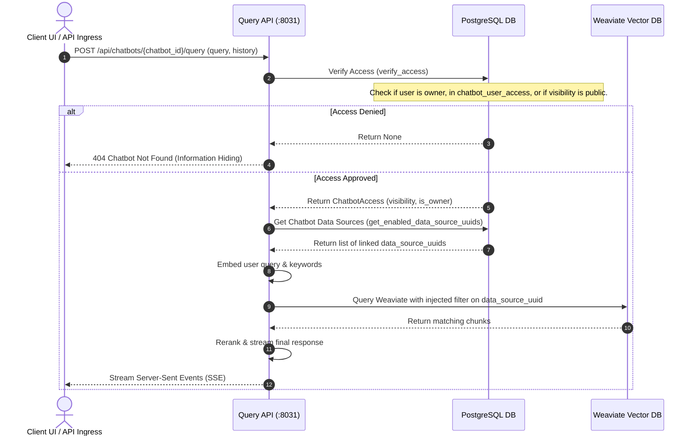

# Jieumchat Chatbot Feature Specification

This document details the database schemas, access control, and search scoping mechanisms that manage the **Chatbot Bundle** feature in the Jieumchat RAG engine.

---

## 1. Chatbot Scoping Architecture

A custom chatbot in Jieumchat is a configuration bundle that scopes RAG queries to a specific subset of data sources (Jira projects and Confluence spaces). The diagram below shows how chatbot queries are routed, verified, and filtered at runtime:



---

## 2. PostgreSQL Relational Schemas

Chatbot configurations, access permissions, and data source mappings are stored in the following PostgreSQL tables:

```sql
-- 1. Chatbot Config Registry
CREATE TABLE IF NOT EXISTS chatbot_config (
    chatbot_id          UUID PRIMARY KEY DEFAULT gen_random_uuid(),
    display_name        TEXT NOT NULL,
    description         TEXT NOT NULL DEFAULT '',
    visibility          TEXT NOT NULL DEFAULT 'private', -- 'public' or 'private'
    created_by_user_id  TEXT NOT NULL,
    created_on          TIMESTAMPTZ NOT NULL DEFAULT now(),
    updated_on          TIMESTAMPTZ NOT NULL DEFAULT now()
);

-- 2. Chatbot Data Source Bindings (Junction Table)
CREATE TABLE IF NOT EXISTS chatbot_data_sources (
    chatbot_id          UUID NOT NULL REFERENCES chatbot_config(chatbot_id) ON DELETE CASCADE,
    data_source_uuid    UUID NOT NULL REFERENCES data_source_config(uuid) ON DELETE CASCADE,
    PRIMARY KEY (chatbot_id, data_source_uuid)
);

-- 3. Access Share Registry for Private Chatbots
CREATE TABLE IF NOT EXISTS chatbot_user_access (
    chatbot_id          UUID NOT NULL REFERENCES chatbot_config(chatbot_id) ON DELETE CASCADE,
    user_id             TEXT NOT NULL,
    PRIMARY KEY (chatbot_id, user_id)
);
```

---

## 3. Core System Logic

### 3.1. Information-Hiding Access Verification (`verify_access`)
To prevent unauthorized users from discovering the existence of private chatbots, the system uses an **information-hiding policy**:
*   If a chatbot does not exist, or if a user lacks access to it, the verification step raises a generic `ChatbotNotFound` exception.
*   The router maps this exception to a standard `404 Not Found` response.

```python
async def verify_access(chatbot_id: str, caller: str) -> ChatbotAccess:
    # Single-round-trip lookup checks ownership, shared access, and public visibility
    row = await _repo.fetch_access(chatbot_id, caller)
    if row is None or not row.has_access:
        raise ChatbotNotFound(chatbot_id)
    return ChatbotAccess(visibility=row.visibility, is_owner=row.is_owner)
```

### 3.2. Data Source Resolution (`get_enabled_data_source_uuids`)
When executing a search:
*   **Standard Search** (no chatbot): The search scope is set to all data sources enabled by the user in `user_enabled_data_sources` that are approved (`crawl_approval_status = 'approved'`).
*   **Chatbot Search**: The search scope is set directly to the sources linked to the chatbot in `chatbot_data_sources`.

```python
async def get_enabled_data_source_uuids(user: str, chatbot_id: str | None = None) -> List[str]:
    if chatbot_id is None:
        sql = """
            SELECT e.data_source_uuid FROM user_enabled_data_sources e
            JOIN data_source_config c ON c.uuid = e.data_source_uuid
            WHERE e.user_id = $1 AND c.crawl_approval_status = 'approved'
        """
        params = (user,)
    else:
        sql = """
            SELECT data_source_uuid FROM chatbot_data_sources
            WHERE chatbot_id = $1
        """
        params = (chatbot_id,)
    # Execute query...
```

### 3.3. Injected Filter Retrieval (`retrieve_relevant_chunks`)
The resolved `data_source_uuid`s are injected directly into Weaviate's search filters to restrict the search:

```python
data_source_filter = Filter.by_property("data_source_uuid").contains_any(enabled_uuids)
resp = await collection.query.hybrid(
    query=keyword_str,
    vector=query_vec,
    filters=data_source_filter,
    limit=top_k,
    return_properties=CHUNK_RETURN_PROPERTIES
)
```

---

## 4. Interview Pitch Script

If an interviewer asks you: **"How did you design a customizable chatbot system that limits its search context to specific data sources?"**

> *"In our RAG pipeline, we allow users to create custom chatbots that search across a specific set of data sources. 
> 
> We implement this using a configuration registry in PostgreSQL. We store the chatbot metadata, visibility rules, and a junction table linking the chatbot to its authorized data source UUIDs. 
> 
> When a query is made to a chatbot, the API first checks the user's access rights. If approved, we fetch the data source UUIDs associated with that chatbot. We then inject these UUIDs as a metadata filter in our Weaviate query. This restricts the RAG search context strictly to the documents linked to the chatbot, ensuring query isolation and data privacy."*
