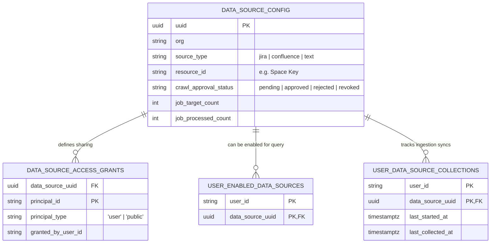

# Jieumchat Data Source Logic & Management Specification

This document details the database architecture, authorization scopes, visibility rules, and search enablement mechanisms that govern **Data Sources** in Jieumchat.

---

## 1. Relational Database Architecture

Data sources are structured to support fine-grained, multi-tenant sharing. The relationship between configuration, access grants, search enablement, and crawl states is shown below:



---

## 2. Core Functional Logic

### 2.1. Visibility Rules
A data source is visible to a user if any of the following conditions are met:
1.  **Ownership/Self Grant**: The user created the data source (`principal_id = user_id`, `granted_by_user_id = user_id`).
2.  **Explicit Shared Grant**: The user was invited to the data source by its creator (`principal_id = user_id`, `granted_by_user_id != user_id`).
3.  **Public Scope**: The data source has a public access grant (`principal_id = '__PUBLIC__'`, `principal_type = 'public'`).

---

### 2.2. Category & Manageability Logic
When a user lists their visible data sources via the `/data-sources` API, the system evaluates their access permissions to categorize their relationship with the resource:

*   **`only_me`**: The user created the data source and has not shared it.
*   **`shared_by_me`**: The user created the data source and has shared it with another user or made it public.
*   **`shared_with_me`**: The user was invited to access the data source, or it is a public resource owned by someone else.
*   **`manageable`**: Set to `True` if the user is the original creator. Only manageable users can rename resources, manage share invitations, or delete the data source.

```python
def _derive_category_and_manageable(me: str, grants: list[AccessGrant]) -> tuple[ListCategory, bool]:
    my_self = False
    my_share = False
    for g in grants:
        if g.granted_by_user_id == me and g.principal_id == me:
            my_self = True
        elif g.granted_by_user_id == me and g.principal_id != me:
            my_share = True

    if my_share:
        category = "shared_by_me"
    elif my_self:
        category = "only_me"
    else:
        category = "shared_with_me"
    return category, my_self
```

---

### 2.3. Search Inclusion: Visibility vs. Enablement
In Jieumchat, visibility and query inclusion are decoupled to give users control over their search results:
*   **Visibility**: Determines if a user can see a data source in their dashboard.
*   **Enablement**: Controls if a data source is included in their RAG query candidates.
*   **The Enablement Toggle**: Users can toggle this setting via the `PATCH /data-sources/{id}` API. This adds or removes a row in the `user_enabled_data_sources` table.

---

### 2.4. Ingestion Sync Watermarks
Crawl jobs log their progress in the `user_data_source_collections` table:
*   `last_started_at`: Timestamp when the background crawler started scanning the resource.
*   `last_collected_at`: Timestamp when the crawler finished chunking, embedding, and indexing the updated documents.

---

## 3. Interview Pitch Script

If an interviewer asks you: **"How did you design the permissions and search settings for your RAG data sources?"**

> *"In our RAG pipeline, we decoupled document visibility from search enablement to give users control over their queries. 
> 
> A database config table stores the metadata for each data source, while sharing permissions are managed using access grant lists. A data source is visible to a user if they own it, if they have been invited to it, or if it is marked public. 
> 
> However, to keep search results relevant, users must explicitly toggle which visible data sources they want to include in their active queries. This setting is stored in a search enablement table, and the resolved source UUIDs are injected as a metadata filter into Weaviate at query time. This design isolates data between organizations and ensures search results remain scoped and relevant."*
