# Jieumchat Relational & Vector DB Schema Interview Spec

This document details the dual-tier database architecture (PostgreSQL and Weaviate) for **Jieumchat**, mapping their schemas, configurations, entity relationships, and cross-database query mechanics to support senior systems and database design interviews at Align.

---

## 1. High-Level Summary & Storage Strategy

Jieumchat splits its storage tier to separate transactional metadata from high-dimensional semantic search indexing:

1.  **PostgreSQL (Transactional Metadata & ACLs)**:
    *   *Role*: Authoritative registry for user Personal Access Tokens (PATs), explicit access grants (`data_source_access_grants`), active search filters, and shared chatbot configs.
    *   *Characteristics*: ACID compliance, strict referential integrity (foreign keys with cascade delete), and relational indexes for quick lookups.
2.  **Weaviate (Vector & Document Store)**:
    *   *Role*: Stores vectorized text chunks, complete issue/page hierarchies, comments, and synced user directories.
    *   *Characteristics*: Scalable multi-tenancy, dense vector indexing, and hybrid search (combining dense vector retrieval with BM25 keyword matching).

---

## 2. PostgreSQL Relational Data Dictionary

### 2.1. `data_source_config` (Root Connections)
Defines a target repository (Jira project, Confluence space, or local text document folder) synced into the system.
*   `uuid` (`UUID`, Primary Key): Generated identifier (UUIDv5) used by Weaviate vector records to match this source.
*   `org` (`TEXT`): Organization identifier (e.g., `mx`, `joyent`).
*   `source_type` (`TEXT`): Type classification (`jira`, `confluence`, `text`).
*   `resource_id` / `normalized_resource_id` (`TEXT`): Atlassian Space/Project key or normalized search string.
*   `crawl_approval_status` (`TEXT`): State tracker (`pending`, `approved`, `rejected`).
*   `job_target_document_count` / `job_processed_document_count` (`INTEGER`): Crawling counters used to report sync progress.
*   `scope` (`TEXT`): Default access scope (`private` or `public`).
*   `owner_user_id` (`TEXT`): Owner user ID.

### 2.2. `user_pat` (Access Credentials)
Stores the Personal Access Tokens (PATs) used by the scheduler to crawl Atlassian instances.
*   `user_id` / `org` / `source_type` (`TEXT`, Composite Primary Key): Natural composite PK.
*   `token` (`TEXT`): Encrypted PAT credential.
*   `is_valid` (`BOOLEAN`): Validation flag. Automatically checked by scheduler.
*   `is_valid_checked_at` (`TIMESTAMPTZ`): Timestamp of the last authentication check.
*   `invalid_reason` (`TEXT`): Diagnostic text for authentication failures.
*   `initial_sync_status` (`TEXT`): First-run crawl state (`pending`, `running`, `completed`, `failed`).
*   `initial_sync_completed_at` (`TIMESTAMPTZ`): Audit timestamp for sync completion.

### 2.3. `data_source_access_grants` (Access Control Lists)
Maintains explicit permissions for data sources.
*   `data_source_uuid` (`UUID`, Composite PK, FK -> `data_source_config`): target dataset.
*   `principal_id` (`TEXT`, Composite PK): Authorized user ID or special keyword `"__PUBLIC__"`.
*   `granted_by_user_id` (`TEXT`, Composite PK): ID of the owner who authorized this grant.
*   `principal_type` (`TEXT`): Type classification (`user` or `public`).
*   `grant_source` (`TEXT`): Invitation path (`self`, `invitation`, `public`).

### 2.4. `user_enabled_data_sources` (Search Filters)
Stores active data source selections toggled by users for search queries.
*   `user_id` / `data_source_uuid` (`TEXT` / `UUID`, Composite Primary Key): Foreign key to config.

### 2.5. `user_data_source_collections` (Sync Timestamps)
Tracks the synchronization state and timing for data sources.
*   `user_id` / `data_source_uuid` (`TEXT` / `UUID`, Composite Primary Key): Foreign key to config.
*   `last_started_at` / `last_collected_at` (`TIMESTAMPTZ`): Timestamps used to track crawling intervals.

### 2.6. `confluence_user_accounts` (Identity Maps)
Maps internal system users to Confluence accounts.
*   `user_id` / `org` (`TEXT`, Composite Primary Key): Maps user IDs across organizations.
*   `account_id` (`TEXT`): Internal Confluence ID used to resolve page permissions.

### 2.7. `data_source_documents` (Manual Uploads)
Manages manual text documents uploaded to `text` type data sources.
*   `id` (`UUID`, Primary Key): Document identifier.
*   `data_source_uuid` (`UUID`, FK -> `data_source_config`): Parent data source.
*   `title` / `body` (`TEXT`): Text fields.
*   `content_format` (`TEXT`): Format type (`plain_text` or `markdown`).
*   `index_status` (`TEXT`): Embedding queue state (`queued`, `indexing`, `available`, `failed`).
*   `index_error` (`TEXT`): Error details if processing failed.
*   `version` (`INTEGER`): Incremental version counter.

### 2.8. `chatbot_config` (Chatbot Instances)
Stores configurations for shared, custom-scoped chatbots.
*   `chatbot_id` (`UUID`, Primary Key): Chatbot identifier.
*   `display_name` (`TEXT`): Chatbot name (Unique per owner).
*   `description` (`TEXT`): Summary description.
*   `visibility` (`TEXT`): Access level (`private` or `public`).
*   `created_by_user_id` (`TEXT`): Owner user ID.

### 2.9. `chatbot_data_sources` (Chatbot Mappings)
Junction table linking data sources to chatbot bundles.
*   `chatbot_id` (`UUID`, Composite PK, FK -> `chatbot_config`): Linked chatbot.
*   `data_source_uuid` (`UUID`, Composite PK, FK -> `data_source_config`): Linked data source.

### 2.10. `chatbot_user_access` (Chatbot Invites)
Junction table managing access lists for private chatbots.
*   `chatbot_id` (`UUID`, Composite PK, FK -> `chatbot_config`): Target chatbot.
*   `user_id` (`TEXT`, Composite PK): Invited user ID.

---

## 3. Weaviate Vector Database Data Dictionary

Weaviate does not support joins. Relational matching is enforced at query-time by passing filter boundaries based on PostgreSQL ACLs.

### 3.1. `UNIFIED_SCHEMA` (Text Chunk Index)
Stores overlapping chunks of text extracted from Confluence pages, Jira issues, and manual files for semantic search.
*   `data_source_uuid` (`DataType.UUID`, Filterable): Maps back to PostgreSQL `data_source_config(uuid)` for access control checks.
*   `chunk_index` (`DataType.INT`): Index position of the chunk in the source document.
*   `chunk_text` (`DataType.TEXT`, Searchable): The raw text chunk. Vectorized via the 1536-dimension `nomic-embed-text-v1-5` model.
*   `source` (`DataType.TEXT`, Filterable, Tokenization=Field): Origin type (`jira`, `confluence`, or `text`).
*   `document_id` (`DataType.TEXT`, Filterable, Tokenization=Field): Unique identifier (e.g. issue key `SSO-123` or page ID).
*   `link` / `title` (`DataType.TEXT`): Display metadata.
*   `labels` / `person_names` / `person_ids` (`DataType.TEXT_ARRAY`, Filterable): Classification tags and user mentions.

### 3.2. `RECORD_SCHEMA` (Full Structured Documents)
Stores complete documents, issue details, and comment threads. Used by the agent loop to gather complete document context.
*   `data_source_uuid` (`DataType.UUID`, Filterable): Access control check boundary mapping.
*   `source` / `record_id` / `record_type` (`DataType.TEXT`, Filterable): Document details (`issue`, `page`, `comment`).
*   `document_id` / `root_document_id` / `parent_record_id` (`DataType.TEXT`, Filterable): Hierarchy linkage keys.
*   `is_primary_record` (`DataType.BOOL`, Filterable): True if the record represents the main document; False if it is a child comment.
*   `title` / `body_text` (`DataType.TEXT`, Searchable): Document titles and raw descriptions/bodies.
*   `created_on` / `updated_on` (`DataType.DATE`, Range-Filterable): Timestamps used for recency-based re-ranking.
*   `assignee_name` (`DataType.TEXT`, Filterable): Name of assigned user.
*   `components` (`DataType.TEXT_ARRAY`, Filterable): Linked Jira components.
*   `raw_metadata` (`DataType.TEXT`): Raw JSON string from Atlassian APIs.

### 3.3. `ENTITY_SCHEMA` (Identity Directory)
Indexes user accounts and profiles synced from Atlassian to map internal permissions and resolve mentions.
*   `data_source_uuid` (`DataType.UUID`, Filterable): Access control check boundary mapping.
*   `source` (`DataType.TEXT`, Filterable, Tokenization=Field): Connection source (`jira`, `confluence`).
*   `entity_id` / `entity_type` (`DataType.TEXT`, Filterable, Tokenization=Field): Profile identifiers and type codes.
*   `canonical_name` / `aliases` (`DataType.TEXT`, Searchable): Synced usernames and mention nicknames.
*   `username` / `email` (`DataType.TEXT`, Filterable, Tokenization=Field): Target authentication variables.
*   `last_seen_on` (`DataType.DATE`, Filterable): Sync timestamps for identity verification.

---

## 4. Entity Mappings & Cross-Database Relations

```mermaid
erDiagram
    %% PostgreSQL Relational Tables
    DATA_SOURCE_CONFIG {
        uuid UUID PK
        org TEXT
        source_type TEXT
        resource_id TEXT
        owner_user_id TEXT
    }
    
    DATA_SOURCE_ACCESS_GRANTS {
        data_source_uuid UUID FK "PK"
        principal_id TEXT PK
        granted_by_user_id TEXT PK
        principal_type TEXT
        grant_source TEXT
    }

    USER_ENABLED_DATA_SOURCES {
        user_id TEXT PK
        data_source_uuid UUID FK "PK"
    }

    CHATBOT_CONFIG {
        chatbot_id UUID PK
        display_name TEXT
        visibility TEXT
        created_by_user_id TEXT
    }

    CHATBOT_DATA_SOURCES {
        chatbot_id UUID FK "PK"
        data_source_uuid UUID FK "PK"
    }

    CHATBOT_USER_ACCESS {
        chatbot_id UUID FK "PK"
        user_id TEXT PK
    }

    %% Weaviate Collections (The Three Core Layers)
    WEAVIATE_UNIFIED_SCHEMA {
        data_source_uuid UUID "Filter Key"
        chunk_text TEXT "Searchable"
        document_id TEXT "Filter Key"
        vector Vector "1536d nomic"
    }

    WEAVIATE_RECORD_SCHEMA {
        data_source_uuid UUID "Filter Key"
        record_id TEXT PK
        record_type TEXT
        body_text TEXT "Searchable"
    }

    WEAVIATE_ENTITY_SCHEMA {
        data_source_uuid UUID "Filter Key"
        entity_id TEXT PK
        canonical_name TEXT "Searchable"
        email TEXT "Filter Key"
    }

    %% Relational Joins (PostgreSQL)
    DATA_SOURCE_CONFIG ||--o{ DATA_SOURCE_ACCESS_GRANTS : "defines permissions"
    DATA_SOURCE_CONFIG ||--o{ USER_ENABLED_DATA_SOURCES : "tracks active filters"
    DATA_SOURCE_CONFIG ||--o{ CHATBOT_DATA_SOURCES : "links to chatbots"
    CHATBOT_CONFIG ||--o{ CHATBOT_DATA_SOURCES : "bundles sources"
    CHATBOT_CONFIG ||--o{ CHATBOT_USER_ACCESS : "defines chatbot access lists"

    %% Dynamic Runtime Filter Connections (Cross-DB mapping)
    DATA_SOURCE_CONFIG ||..o{ WEAVIATE_UNIFIED_SCHEMA : "validates access (dynamic search filter)"
    DATA_SOURCE_CONFIG ||..o{ WEAVIATE_RECORD_SCHEMA : "validates access (dynamic record filter)"
    DATA_SOURCE_CONFIG ||..o{ WEAVIATE_ENTITY_SCHEMA : "validates access (dynamic entity filter)"
```



---

## 5. Mock Interview Questions & Technical Answers

### Question 1: PostgreSQL ACL Enforcement
> **Interviewer:** *"Explain how your database schema prevents users from accessing vector search results they shouldn't see. Write a query that computes all allowed data source UUIDs for a given user."*

**Ideal Candidate Answer:**
> "To enforce security, we separate permissions from vectors. Access grants are kept in PostgreSQL (`data_source_access_grants` and `chatbot_user_access`). When a user runs a query, we retrieve all authorized data sources using a database query. 
> 
> Here is the SQL query to resolve authorized data sources for a user like `'bk21.choi'`:
```sql
-- 1. Direct grants to the user & public resources
SELECT data_source_uuid 
FROM data_source_access_grants
WHERE (principal_id = 'bk21.choi' AND principal_type = 'user')
   OR (principal_id = '__PUBLIC__' AND principal_type = 'public')

UNION

-- 2. Data sources from chatbots owned by the user
SELECT cds.data_source_uuid
FROM chatbot_data_sources cds
JOIN chatbot_config cc ON cds.chatbot_id = cc.chatbot_id
WHERE cc.created_by_user_id = 'bk21.choi'

UNION

-- 3. Data sources from chatbots shared with the user
SELECT cds.data_source_uuid
FROM chatbot_data_sources cds
JOIN chatbot_user_access cua ON cds.chatbot_id = cua.chatbot_id
WHERE cua.user_id = 'bk21.choi';
```
> The resolved UUID list is then injected directly into Weaviate's search query filters, ensuring the database engine filters out restricted data during vector retrieval."

---

### Question 2: Weaviate Multi-Tenancy & Query Mechanics
> **Interviewer:** *"Weaviate supports multi-tenancy by splitting collections into separate physical tenants. Why did you choose a metadata-based filtering approach using `data_source_uuid` instead of Weaviate's native tenant feature? How do you perform a secure search query using Weaviate's Python client?"*

**Ideal Candidate Answer:**
> "Weaviate's native multi-tenancy isolates data by physical tenant, which works well if each user maps to exactly one tenant. However, in our system, users have access to a dynamically changing mix of data sources based on group memberships, ownerships, and sharing permissions. If we used native tenants, we would have to duplicate vector chunks across tenants whenever a space is shared, leading to high storage and embedding costs.
> 
> Instead, we use a single shared index and apply metadata filtering. By indexing `data_source_uuid` with a filterable index, we run single-tenant queries with multi-tenant permissions.
> 
> Here is how we query Weaviate using the Python client with injected ACLs:
```python
from weaviate.classes.query import Filter

# 1. Resolve authorized data source UUIDs from PostgreSQL
allowed_uuids = ["uuid-1111-...", "uuid-2222-..."]

# 2. Query the Unified collection using metadata filters
collection = weaviate_client.collections.get("UnifiedSchema")
response = collection.query.hybrid(
    query="Samsung SSO setup guide",
    filters=Filter.by_property("data_source_uuid").contains_any(allowed_uuids),
    alpha=0.5, # Balance vector and BM25 keywords
    limit=5
)

for obj in response.objects:
    print(obj.properties["chunk_text"], obj.properties["document_id"])
```
> This ensures that Weaviate filters search results at the index level, preventing unauthorized access."
