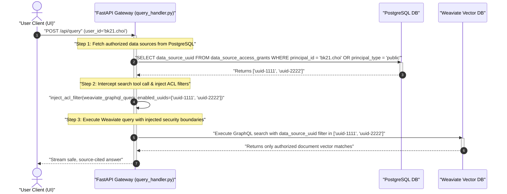

# Jieumchat Database Schema Specification

This document provides a production-grade, detailed reference of the dual-tier database architecture used in the **Jieumchat** enterprise RAG system. The architecture separates structural metadata, configuration, and security ACLs in **PostgreSQL** from high-performance vector search chunks and document trees in **Weaviate**.

---

## 1. System Storage Strategy

The database tier is designed to handle different concerns by separating transactional safety from semantic querying:

*   **PostgreSQL (Metadata, Credentials, & ACLs)**:
    *   *Role*: Authoritative source of truth for user access control lists (ACLs), Personal Access Tokens (PATs), crawler job states, and shared chatbot configurations.
    *   *Why*: Relational data requires strict transaction boundaries (ACID), referential integrity (cascade delete rules when data sources are removed), and fast index-based lookups.
*   **Weaviate (Vector & Document Store)**:
    *   *Role*: Indexed storage of document chunks with their vector embeddings, document structures (Jira tickets, Confluence pages, comments), and entity mappings.
    *   *Why*: Supports low-latency hybrid search (combining dense vector embeddings with BM25 keyword matching) and structured GraphQL queries.

---

## 2. PostgreSQL Relational Database Schema

### 2.1. Entity Relationship Diagram (ERD)

```mermaid
erDiagram
    DATA_SOURCE_CONFIG {
        uuid UUID PK
        org TEXT
        source_type TEXT
        resource_id TEXT
        normalized_resource_id TEXT
        crawl_approval_status TEXT
        job_target_document_count INTEGER
        job_processed_document_count INTEGER
        scope TEXT
        owner_user_id TEXT
        created_on TIMESTAMPTZ
        updated_on TIMESTAMPTZ
    }

    USER_PAT {
        user_id TEXT PK
        org TEXT PK
        source_type TEXT PK
        token TEXT
        is_valid BOOLEAN
        is_valid_checked_at TIMESTAMPTZ
        invalid_reason TEXT
        initial_sync_status TEXT
        initial_sync_completed_at TIMESTAMPTZ
        created_on TIMESTAMPTZ
        updated_on TIMESTAMPTZ
    }

    DATA_SOURCE_ACCESS_GRANTS {
        data_source_uuid UUID PK "FK to DATA_SOURCE_CONFIG"
        principal_id TEXT PK
        granted_by_user_id TEXT PK
        principal_type TEXT "user | public"
        grant_source TEXT
        created_on TIMESTAMPTZ
        updated_on TIMESTAMPTZ
    }

    USER_ENABLED_DATA_SOURCES {
        user_id TEXT PK
        data_source_uuid UUID PK "FK to DATA_SOURCE_CONFIG"
        created_on TIMESTAMPTZ
        updated_on TIMESTAMPTZ
    }

    USER_DATA_SOURCE_COLLECTIONS {
        user_id TEXT PK
        data_source_uuid UUID PK "FK to DATA_SOURCE_CONFIG"
        last_started_at TIMESTAMPTZ
        last_collected_at TIMESTAMPTZ
        created_on TIMESTAMPTZ
        updated_on TIMESTAMPTZ
    }

    CONFLUENCE_USER_ACCOUNTS {
        user_id TEXT PK
        org TEXT PK
        account_id TEXT
        created_on TIMESTAMPTZ
        updated_on TIMESTAMPTZ
    }

    DATA_SOURCE_DOCUMENTS {
        id UUID PK
        data_source_uuid UUID FK "FK to DATA_SOURCE_CONFIG"
        title TEXT
        body TEXT
        content_format TEXT "plain_text | markdown"
        index_status TEXT "queued | available | failed"
        index_error TEXT
        version INTEGER
        created_by TEXT
        updated_by TEXT
        created_on TIMESTAMPTZ
        updated_on TIMESTAMPTZ
    }

    CHATBOT_CONFIG {
        chatbot_id UUID PK
        display_name TEXT
        description TEXT
        visibility TEXT "public | private"
        created_by_user_id TEXT
        created_on TIMESTAMPTZ
        updated_on TIMESTAMPTZ
    }

    CHATBOT_DATA_SOURCES {
        chatbot_id UUID PK "FK to CHATBOT_CONFIG"
        data_source_uuid UUID PK "FK to DATA_SOURCE_CONFIG"
        created_on TIMESTAMPTZ
    }

    CHATBOT_USER_ACCESS {
        chatbot_id UUID PK "FK to CHATBOT_CONFIG"
        user_id TEXT PK
        created_on TIMESTAMPTZ
    }

    FEEDBACK {
        id BIGSERIAL PK
        req_id TEXT
        user_id TEXT
        user_email TEXT
        question TEXT
        answer TEXT
        feedback TEXT
        langfuse_trace_id TEXT
        created_on TIMESTAMPTZ
        updated_on TIMESTAMPTZ
    }

    DATA_SOURCE_CONFIG ||--o{ DATA_SOURCE_ACCESS_GRANTS : "cascades deletion"
    DATA_SOURCE_CONFIG ||--o{ USER_ENABLED_DATA_SOURCES : "cascades deletion"
    DATA_SOURCE_CONFIG ||--o{ USER_DATA_SOURCE_COLLECTIONS : "cascades deletion"
    DATA_SOURCE_CONFIG ||--o{ DATA_SOURCE_DOCUMENTS : "cascades deletion"
    DATA_SOURCE_CONFIG ||--o{ CHATBOT_DATA_SOURCES : "cascades deletion"

    CHATBOT_CONFIG ||--o{ CHATBOT_DATA_SOURCES : "cascades deletion"
    CHATBOT_CONFIG ||--o{ CHATBOT_USER_ACCESS : "cascades deletion"
```



---

### 2.2. Table-by-Table Data Dictionary

#### 1. `DATA_SOURCE_CONFIG`
Defines a root knowledge scope extracted from Jira or Confluence (e.g. MX Jira project or Joyent Confluence space).
*   `uuid` (`UUID`, Primary Key): Automatically generated identifier.
*   `org` (`TEXT`): Organization identifier (`mx` for Samsung Data Center on-prem, `joyent` for Atlassian Cloud).
*   `source_type` (`TEXT`): Type of connector (`jira`, `confluence`, or local `text` upload).
*   `resource_id` (`TEXT`): Space Key for Confluence, or Project Key for Jira.
*   `normalized_resource_id` (`TEXT`): Uppercase, stripped resource identifier used for lookup queries.
*   `crawl_approval_status` (`TEXT`): Governance gate flag (`approved`, `rejected`, or `pending`). The collection process only indexes approved sources.
*   `job_target_document_count` (`INTEGER`): Total documents discovered during the `DETECT` phase.
*   `job_processed_document_count` (`INTEGER`): Total documents processed, chunked, and stored in Weaviate.
*   `scope` (`TEXT`): Visibility status (`public` or `private`).
*   `owner_user_id` (`TEXT`): The creator/administrator of this source connection.
*   `created_on` / `updated_on` (`TIMESTAMPTZ`): Governance audit timestamps.

#### 2. `USER_PAT`
Stores the Personal Access Tokens (PATs) used by the background scheduler to connect to Atlassian APIs.
*   `user_id` (`TEXT`, Composite Primary Key): Internal user ID.
*   `org` (`TEXT`, Composite Primary Key): Target organization.
*   `source_type` (`TEXT`, Composite Primary Key): Connector type (`jira` or `confluence`).
*   `token` (`TEXT`): Encrypted credentials (PAT or OAuth token).
*   `is_valid` (`BOOLEAN`): Validation check flag. Invalidated automatically on HTTP `401 Unauthorized` responses.
*   `is_valid_checked_at` (`TIMESTAMPTZ`): Timestamp of the last verification check.
*   `invalid_reason` (`TEXT`): Logs validation error messages.
*   `initial_sync_status` (`TEXT`): Sync state tracker (`pending`, `running`, `completed`, or `failed`).
*   `initial_sync_completed_at` (`TIMESTAMPTZ`): Audit timestamp for sync completion.

#### 3. `DATA_SOURCE_ACCESS_GRANTS`
The security mapping table used for delegated access.
*   `data_source_uuid` (`UUID`, Composite Primary Key): Foreign key to `DATA_SOURCE_CONFIG` (Cascades on delete).
*   `principal_id` (`TEXT`, Composite Primary Key): The entity receiving access (either a specific User ID or the keyword `"public"`).
*   `granted_by_user_id` (`TEXT`, Composite Primary Key): User who authorized this permission.
*   `principal_type` (`TEXT`): Type classification (`user` or `public`).
*   `grant_source` (`TEXT`): Logs origin details (`direct_share`, `ownership`, or `chatbot_sync`).

#### 4. `USER_ENABLED_DATA_SOURCES`
Tracks which of a user's visible data sources are currently active for search queries.
*   `user_id` (`TEXT`, Composite Primary Key): Internal user ID.
*   `data_source_uuid` (`UUID`, Composite Primary Key): Foreign key to `DATA_SOURCE_CONFIG` (Cascades on delete).

#### 5. `USER_DATA_SOURCE_COLLECTIONS`
Maintains operational collection timestamps per user and data source.
*   `user_id` (`TEXT`, Composite Primary Key): Internal user ID.
*   `data_source_uuid` (`UUID`, Composite Primary Key): Foreign key to `DATA_SOURCE_CONFIG` (Cascades on delete).
*   `last_started_at` (`TIMESTAMPTZ`): Start timestamp of the last collection job.
*   `last_collected_at` (`TIMESTAMPTZ`): Completion timestamp of the last collection job.

#### 6. `CONFLUENCE_USER_ACCOUNTS`
Resolves user mapping configurations between the internal system and Confluence.
*   `user_id` (`TEXT`, Composite Primary Key): Internal user ID.
*   `org` (`TEXT`, Composite Primary Key): Target organization.
*   `account_id` (`TEXT`): Confluence-internal user hash.

#### 7. `DATA_SOURCE_DOCUMENTS`
Manages draft metadata, file descriptions, and indexing states for manual text uploads.
*   `id` (`UUID`, Primary Key): Unique document identifier.
*   `data_source_uuid` (`UUID`, Foreign Key): Foreign key to `DATA_SOURCE_CONFIG` (Cascades on delete).
*   `title` (`TEXT`): Document title.
*   `body` (`TEXT`): Raw text body.
*   `content_format` (`TEXT`): Format type (`plain_text` or `markdown`).
*   `index_status` (`TEXT`): Index state tracker (`queued`, `available`, or `failed`).
*   `index_error` (`TEXT`): Error details if processing failed.
*   `version` (`INTEGER`): Incremental change version.

#### 8. `CHATBOT_CONFIG`
Stores shared, curated chatbot configurations.
*   `chatbot_id` (`UUID`, Primary Key): Unique system identifier.
*   `display_name` (`TEXT`): Title displayed in the UI. Has a unique constraint scoped to the owner (`UNIQUE (created_by_user_id, display_name)`).
*   `description` (`TEXT`): Long-form chatbot description.
*   `visibility` (`TEXT`): Visibility status (`public` or `private`).
*   `created_by_user_id` (`TEXT`): The creator and owner of this chatbot.

#### 9. `CHATBOT_DATA_SOURCES`
Junction table mapping data sources bundled inside a chatbot.
*   `chatbot_id` (`UUID`, Composite Primary Key): Foreign key to `CHATBOT_CONFIG` (Cascades on delete).
*   `data_source_uuid` (`UUID`, Composite Primary Key): Foreign key to `DATA_SOURCE_CONFIG` (Cascades on delete).

#### 10. `CHATBOT_USER_ACCESS`
Junction table listing non-owner users authorized to access a private chatbot.
*   `chatbot_id` (`UUID`, Composite Primary Key): Foreign key to `CHATBOT_CONFIG` (Cascades on delete).
*   `user_id` (`TEXT`, Composite Primary Key): Authorized user identifier.

---

## 3. Weaviate Vector Database Schema

Weaviate acts as the search index. It does not use join tables; instead, it enforces access permissions at query time using dynamic metadata checks.

### 3.1. Collection: `UNIFIED_SCHEMA`
This collection holds document text split into overlapping chunks, optimized for dense semantic retrieval and keyword matching.

| Property Name | Data Type | Index Config | Purpose / Description |
| :--- | :--- | :--- | :--- |
| `data_source_uuid` | `string` | Field Filter | References the PostgreSQL `DATA_SOURCE_CONFIG` table for ACL checks. |
| `chunk_index` | `int` | None | Sequence position of the chunk in the document. |
| `chunk_text` | `text` | Vectorized | Text content. Vectorized using the 1536-dimension `nomic-embed-text-v1-5` model. |
| `source` | `string` | Field Filter | Connection type (`jira`, `confluence`, or `text`). |
| `document_id` | `string` | Field Filter | Original issue key (e.g. `SSO-123`) or Confluence page ID. |
| `link` | `string` | None | Direct URL path to the source document. |
| `title` | `text` | Keyword Index | Title of the parent document. |
| `labels` | `string[]` | Keyword Index | Atlassian labels. |
| `person_names` | `string[]` | Keyword Index | Extracted usernames mentioned in the text. |

### 3.2. Collection: `RECORD_SCHEMA`
This collection stores entire structured documents (such as Jira issues, Confluence pages, and comments) to allow the Agent loop to fetch complete context blocks.

| Property Name | Data Type | Index Config | Purpose / Description |
| :--- | :--- | :--- | :--- |
| `data_source_uuid` | `string` | Field Filter | References `DATA_SOURCE_CONFIG` for ACL checks. |
| `source` | `string` | Field Filter | Connection type (`jira`, `confluence`, `text`). |
| `record_id` | `string` (Key) | Field Filter | Unique identifier (e.g. `jira_issue_SSO-123` or `confluence_page_89231`). |
| `record_type` | `string` | Field Filter | Record classification (`issue`, `page`, or `comment`). |
| `document_id` | `string` | Field Filter | Root document key. Links comments to their parent issue or page. |
| `is_primary_record`| `boolean` | Field Filter | Flags whether this is the parent document or a comment record. |
| `title` | `string` | None | Document title. |
| `body_text` | `string` | None | Complete content (descriptions, comments, etc.). |
| `created_on` | `date` | Sorting Index | Original creation date. Used for recency re-ranking. |
| `updated_on` | `date` | Sorting Index | Date of last update. Used for recency re-ranking. |
| `assignee_name` | `string` | Field Filter | Assigne profile name. |
| `components` | `string[]` | Field Filter | Jira component tags. |
| `raw_metadata` | `string` | None | Unstructured JSON payload containing additional fields. |

---

## 4. Database Security & Query Interaction Flow

### 4.1. The Access Control List (ACL) Injection Pattern
At query time, the system prevents privilege escalation by checking PostgreSQL permissions and injecting those boundaries directly into Weaviate search calls.



---

## 5. Key Relational Constraints & Database Best Practices

*   **Foreign Key Cascade Deletions**:
    Jieumchat ensures that database state remains clean and secure. If an administrator deletes a `DATA_SOURCE_CONFIG` entry, all related records in `DATA_SOURCE_ACCESS_GRANTS`, `USER_ENABLED_DATA_SOURCES`, and `CHATBOT_DATA_SOURCES` are automatically deleted by the database cascade constraint:
    ```sql
    ALTER TABLE data_source_access_grants
    ADD CONSTRAINT fk_data_source_uuid
    FOREIGN KEY (data_source_uuid)
    REFERENCES data_source_config(uuid)
    ON DELETE CASCADE;
    ```
*   **Chatbot Ownership Isolation**:
    Chatbot configurations have a composite unique constraint on `(created_by_user_id, display_name)`. This allows different users to create chatbots with the same name without causing database conflicts:
    ```sql
    ALTER TABLE chatbot_config
    ADD CONSTRAINT chatbot_display_name_owner_key
    UNIQUE (created_by_user_id, display_name);
    ```
*   **Audit Logging**:
    Both relational metadata and vector document models track `created_on`, `updated_on`, `created_by`, and `updated_by` fields. This provides a complete audit trail for compliance and debugging.
