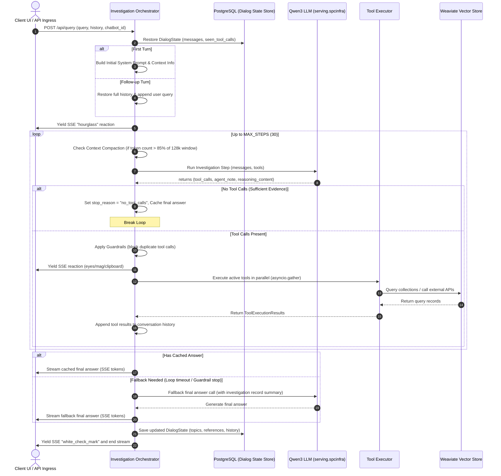

# Jieumchat RAG Agent Loop & Orchestration Specification

This specification documents the asynchronous agent loop, tool routing, loop guardrails, context compaction, and state management orchestrated by `investigation_orchestrator.py` in the Jieumchat RAG system.

---

## 1. Orchestration Architecture Overview

Jieumchat utilizes a multi-step, tool-augmented reasoning loop (an agent loop) to resolve user queries. Instead of executing a single vector search, the orchestrator allows the Qwen3 language model to dynamically search, retrieve details, issue raw API queries to Confluence/Jira, and synthesize findings before formulating a final answer.

---

## 2. Key Orchestration Lifecycle Phases

### 2.1. Initialization & State Restoration
When a request hits `run_query_agent`, the orchestrator resolves the conversation's state:
1.  **Retrieve State**: Checks `dialog_state_store` using the `chat_id`. 
2.  **Turn Assessment**:
    *   **Follow-up Turn**: Restores the complete conversation thread (including tool results and prior answers) from `dialog_state.messages` and appends the new user query.
    *   **First Turn**: Initializes a fresh `InvestigationConversation` incorporating a system prompt tailored to the query, context summaries, and the user's initial prompt.

### 2.2. The Reasoning & Execution Loop
The core of the system is a `while` loop restricted by `QUERY_AGENT_INVESTIGATION_MAX_STEPS` (default: `30`):

1.  **Context Compaction**: Evaluates prompt sizes. If active tokens exceed `85%` (`CONTEXT_COMPACTION_SOFT_FILL_RATIO`) of the `128,072` token limit, it compresses the conversation history to avoid token overflow errors.
2.  **Investigation Step**: Invokes Qwen3 to inspect the query and decide whether to fetch more information. It returns:
    *   `tool_calls`: Parsed JSON structures containing tool names and arguments.
    *   `agent_note`: Thoughts explaining the agent's current intent.
    *   `reasoning_content`: Raw model thinking blocks.
3.  **Guardrail Filtration**: 
    *   A unique signature is generated for every tool call: `name::arguments_json`.
    *   If a tool call matches an entry in `seen_tool_calls`, the call is blocked, and an error message is returned to the agent's context.
    *   If a duplicate tool call is blocked `3` times consecutively, the loop breaks with the status `guardrail_max_blocks_reached` to prevent infinite loops.
4.  **Parallel Execution**: Active, non-blocked tool calls are run concurrently using `asyncio.gather()` to minimize latency.
5.  **User Reactions**: Yields SSE reaction events reflecting the active tool (e.g. `eyes` for Weaviate search, `mag` for database document reads).

### 2.3. Final Answer Processing & Fallback
Once the loop breaks, the orchestrator generates the final response:
*   **Direct Answer**: If the agent finished with no tool calls, the cached `agent_note` is streamed directly.
*   **Fallback Resolution**: If the agent exceeded its maximum step count or was stopped by guardrails, the orchestrator compiles the collected observations into a structured summary and invokes `_stream_investigation_final_answer` to generate the final response.

---

## 3. Database State Persistence

Before ending the SSE stream, the orchestrator parses the conversation data and saves the updated state back to PostgreSQL:
*   **State Extraction**: Calls `_save_answer_state` to parse the last answer and extract referenced documents.
*   **Topic Tracking**: Stores active entities and topics in the `DialogState` object.
*   **Reference Logging**: Updates `last_document_refs` and `last_cited_refs` in the database to link user feedback to the relevant source documents.
*   **Complete History Save**: Saves the updated list of conversation messages back to PostgreSQL so follow-up queries have access to the complete interaction history.
