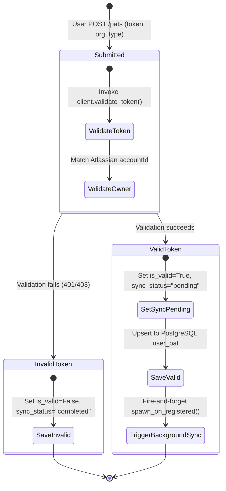

# Jieumchat Personal Access Token (PAT) Management Specification

This document details the design, security logic, state machine transitions, and background synchronization hooks that govern the **Personal Access Token (PAT)** ingestion feature in Jieumchat.

---

## 1. Architectural Lifecycle Diagram

The diagram below maps how a PAT moves from registration through credential validation, storage, and initial background crawler synchronization.



---

## 2. PostgreSQL Schema Reference

PATs are stored in PostgreSQL under the `user_pat` table using a natural composite primary key to ensure uniqueness per user, organization, and source type.

```sql
CREATE TABLE IF NOT EXISTS user_pat (
    user_id                    TEXT NOT NULL,
    org                        TEXT NOT NULL,       -- 'joyent' or 'mx'
    source_type                TEXT NOT NULL,       -- 'jira' or 'confluence'
    token                      TEXT NOT NULL,       -- Encrypted token credential
    is_valid                   BOOLEAN NOT NULL DEFAULT TRUE,
    is_valid_checked_at        TIMESTAMPTZ,
    invalid_reason             TEXT NOT NULL DEFAULT '',
    initial_sync_status        TEXT NOT NULL DEFAULT 'completed', -- 'pending' | 'running' | 'completed' | 'failed'
    initial_sync_completed_at  TIMESTAMPTZ,
    created_on                 TIMESTAMPTZ NOT NULL DEFAULT now(),
    updated_on                 TIMESTAMPTZ NOT NULL DEFAULT now(),
    PRIMARY KEY (user_id, org, source_type)
);

-- Indices for performance
CREATE INDEX IF NOT EXISTS pat_org_type_valid_idx
    ON user_pat (org, source_type) WHERE is_valid;
```

---

## 3. Ingest Operations & Validation Logic

The PAT lifecycle is managed by the `PatOps` service layer.

### 3.1. Registration & Validation (`register`)
1.  **Duplicate Check**: Queries PostgreSQL to check if a token already exists for the `(user_id, org, source_type)` composite key.
2.  **API Verification**: Calls the Atlassian API (`client.validate_token`) to verify the token's validity. If verification fails, it returns the error reason.
3.  **Sync Status Resolution**:
    *   **New or Recovered Tokens**: If the token is valid and is either new or recovered from an invalid state, `initial_sync_status` is set to `'pending'`.
    *   **Valid Updates**: If a valid token is simply being updated, it preserves the current sync status.
    *   **Invalid Tokens**: If the token is invalid, the sync status is set to `'completed'` to prevent crawler blocking.
4.  **Save & Dispatch**: Saves the record to PostgreSQL. If the token is valid and new (or updated), it triggers the background sync callback (`on_registered`).

### 3.2. Token Security Masking
To prevent credentials from leaking through UI views, the `list_pats` API masks token strings before returning them:
*   Tokens with a length $\le 6$ characters are masked as `***`.
*   Tokens with a length $> 6$ characters expose only the first 4 and last 2 characters (e.g. `NjQ3...IhO`).

```python
def _mask_token(token: str) -> str:
    if len(token) <= 6:
        return "***"
    return f"{token[:4]}...{token[-2:]}"
```

### 3.3. Failure Recovery (`recover_pending`)
If an ingestion job gets stuck, the system can trigger a recovery task (`recover_pending`) to restart space discovery:
*   Invokes the `on_registered` callback using the existing token.
*   If the recovery attempt fails, the status is set to `'completed'` in PostgreSQL to prevent crawler blocking.

---

## 4. Interview Pitch Script

If an interviewer asks you: **"How did you design a secure and reliable credential ingestion system for external SaaS integrations?"**

> *"In our data ingestion pipeline, we managed credentials using Personal Access Tokens (PATs) stored in PostgreSQL with a composite key of user, organization, and source type. 
> 
> When a user submits a PAT, we validate it in real-time against Confluence or Jira. If valid, we save the credentials and trigger a background crawler sync task. We managed this sync state using a status column ('pending', 'running', 'completed'). If a token is revoked or expires, a validation check updates the state to suspend active sync jobs for that token.
> 
> To protect token credentials, we masked token values in API list responses to expose only the first few and last few characters, and we implemented an exponential backoff retry mechanism to recover stuck sync jobs without overloading the Atlassian APIs."*
