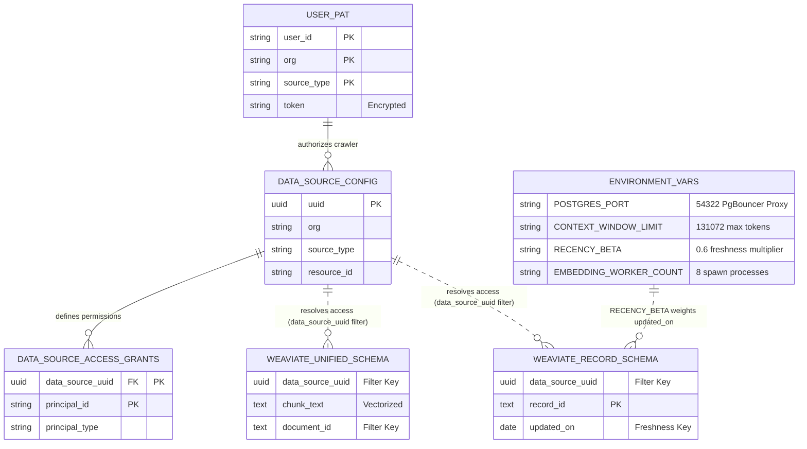

# Jieumchat Database & Environment Interconnectivity Specification

This document maps how PostgreSQL tables, Weaviate vector collections, and environment variables (.env) connect and interact in the Jieumchat RAG system.

---

## 1. System Interlock Schema Diagram

The diagram below shows how the user session, environment configuration limits, relational database registry, and vector database collections link together.

---

## 2. Key Data Mappings

### 2.1. The Shared Index Key (`data_source_uuid`)
*   **PostgreSQL**: `data_source_config.uuid`
*   **Weaviate**: `UNIFIED_SCHEMA.data_source_uuid`, `RECORD_SCHEMA.data_source_uuid`, `ENTITY_SCHEMA.data_source_uuid`
*   **How it connects**: At query time, the API retrieves the user's authorized `data_source_uuid`s from PostgreSQL and injects them as search filters into Weaviate. This keeps data isolated between organizations and projects.

### 2.2. User Sessions & Credentials (`user_id` / `org` / `source_type`)
*   **PostgreSQL**: `user_pat` composite key `(user_id, org, source_type)`
*   **PostgreSQL**: `confluence_user_accounts` composite key `(user_id, org)`
*   **How it connects**: When the background scheduler starts a sync job for a Confluence space (from `data_source_config`), it retrieves the user's credentials (`user_pat.token`) and account mapping (`confluence_user_accounts.account_id`) matching the organization and source type to authenticate crawler requests.

---

## 3. Environment Variable Interlocks

### 3.1. Re-ranking Freshness Controls
*   **Environment Variables**: `RECENCY_BETA="0.6"`, `RECENCY_MIN_RANGE_MONTHS="3"`
*   **Weaviate Collection**: `RECORD_SCHEMA.updated_on` (Date field)
*   **How they connect**: The search engine retrieves matching documents from Weaviate and calculates a freshness score using the document's `updated_on` date. `RECENCY_BETA` determines the weight of this freshness score in the final ranking.

### 3.2. Context Window & Compaction Limits
*   **Environment Variables**: `CONTEXT_WINDOW_LIMIT="131072"`, `CONTEXT_COMPACTION_SOFT_FILL_RATIO="0.85"`
*   **PostgreSQL Collection**: `DialogState.messages` (stored conversation history)
*   **How they connect**: Before sending a query, the system calculates the size of the current conversation history. If the token count exceeds 85% of the 128k limit, the orchestrator triggers an LLM summarization job to compress the conversation history and free up context space.

### 3.3. Database Connection Pooling
*   **Environment Variables**: `POSTGRES_PORT="54322"`, `POSTGRES_POOL_MAX="20"`
*   **PostgreSQL Server**: PgBouncer transaction-level proxy
*   **How they connect**: The API connects to PostgreSQL via PgBouncer on port `54322`. `POSTGRES_POOL_MAX` controls the connection pool size, allowing services to scale without exhausting PostgreSQL connection limits.

### 3.4. Background Crawler Concurrency
*   **Environment Variables**: `EMBEDDING_BATCH_SIZE="64"`, `EMBEDDING_WORKER_COUNT="8"`, `WEAVIATE_WRITER_COUNT="8"`
*   **Weaviate Write Operations**: gRPC batch insertions
*   **How they connect**: The background crawler splits text into chunks and fetches embeddings in batches of 64. The worker processes and writer threads run concurrently to process and write vector records to Weaviate.
