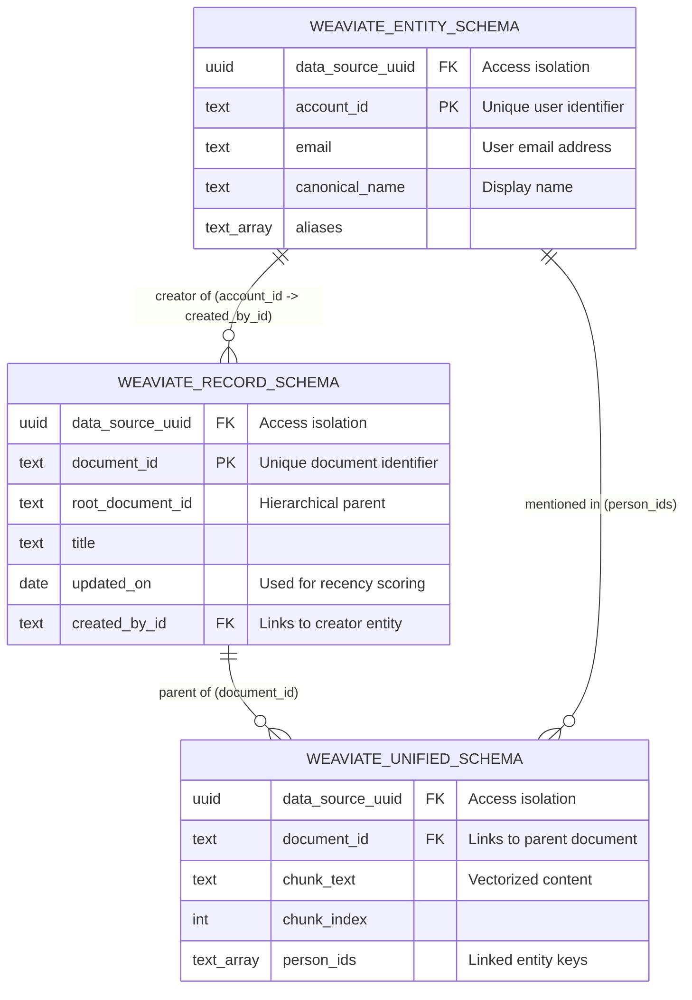

# Jieumchat Weaviate Vector Database Schemas Relation Specification

This document details the three-tier schema architecture in Weaviate—composed of the **Unified Chunk Schema**, **Record Metadata Schema**, and **Entity Directory Schema**—and maps how they relate, connect, and are queried.

---

## 1. The Three-Tier Schema Architecture

To support semantic searches while preserving document hierarchies and user identities, Jieumchat structures its Weaviate database into three distinct collections:

---

## 2. Tier Details & Responsibilities

### 2.1. Unified Schema (`UNIFIED_SCHEMA`)
*   **Purpose**: The primary target for hybrid searches. It holds the split, vectorized text chunks of documents.
*   **Vectorization**: Active. Text embeddings are generated and stored here.
*   **Key Fields**:
    *   `chunk_text`: The text chunk used for search queries.
    *   `document_id`: The ID of the parent document.
    *   `data_source_uuid`: Used for access control filtering.

### 2.2. Record Schema (`RECORD_SCHEMA`)
*   **Purpose**: Holds metadata for whole documents (Confluence pages and Jira tickets). It does not store split vector chunks.
*   **Vectorization**: Disabled (metadata lookup only).
*   **Key Fields**:
    *   `document_id`: Unique identifier for the page or ticket.
    *   `root_document_id` & `parent_record_id`: Used to reconstruct document hierarchies.
    *   `updated_on`: Used to calculate freshness weight during re-ranking.
    *   `created_by_id` / `assignee_id`: Linked keys pointing to user profiles.

### 2.3. Entity Schema (`ENTITY_SCHEMA`)
*   **Purpose**: Synced directory mapping user profiles, team roles, and contact details.
*   **Vectorization**: Disabled (directory lookup only).
*   **Key Fields**:
    *   `account_id` / `source_user_id`: Identifiers matching Atlassian user keys.
    *   `email`: Email address for lookup.
    *   `canonical_name` & `aliases`: Used to match names mentioned in document texts.

---

## 3. Linkage Keys

The collections are linked using the following keys:

1.  **`document_id`** (The Document Link):
    *   Connects a text chunk in `UNIFIED_SCHEMA` to its parent document metadata in `RECORD_SCHEMA`.
2.  **`data_source_uuid`** (The Permission Link):
    *   Enforced across all three collections to ensure queries only search through authorized projects and spaces.
3.  **`account_id` / `created_by_id`** (The Identity Link):
    *   Links user profiles in `ENTITY_SCHEMA` to creators, assignees, or reporters in `RECORD_SCHEMA`, and to mention arrays (`person_ids`) in `UNIFIED_SCHEMA`.

---

## 4. Query Resolution Walkthrough

When a user runs a RAG query (e.g. *"Show setup issues assigned to bk21.choi"*):

1.  **Identify User ID**:
    *   The orchestrator queries `ENTITY_SCHEMA` to resolve `bk21.choi`'s email/name to their `account_id`.
2.  **Run Semantic Search**:
    *   Runs a hybrid search against `UNIFIED_SCHEMA` using the query vector.
3.  **Filter by Assignments**:
    *   Looks up the parent `document_id`s in `RECORD_SCHEMA` to check if `assignee_id` matches the resolved `account_id`.
4.  **Re-rank by Recency**:
    *   Retrieves the `updated_on` date from `RECORD_SCHEMA` to calculate the freshness score and re-rank the search results.
5.  **Return UI Citations**:
    *   Retrieves the document `title` and `link` from `RECORD_SCHEMA` to build clickable citations in the chat interface.

---

## 5. Interview Pitch Script

If an interviewer asks you: **"How did you structure your vector database to support both semantic searches and metadata filters?"**

> *"In our RAG backend, we split our Weaviate database into three collections: a Unified Chunk collection, a Record Metadata collection, and an Entity Directory collection. 
> 
> The Unified Chunk collection stores the vectorized text chunks optimized for hybrid semantic and keyword search. The Record Metadata collection stores document metadata, parent-child hierarchies, and update timestamps, which we use for recency re-ranking and generating UI citations. The Entity Directory collection maps user profiles and account IDs. 
> 
> These collections are connected using document ID and account ID keys. This structure keeps our search index lightweight, simplifies permission filtering, and allows us to perform metadata and identity filtering on search results."*
