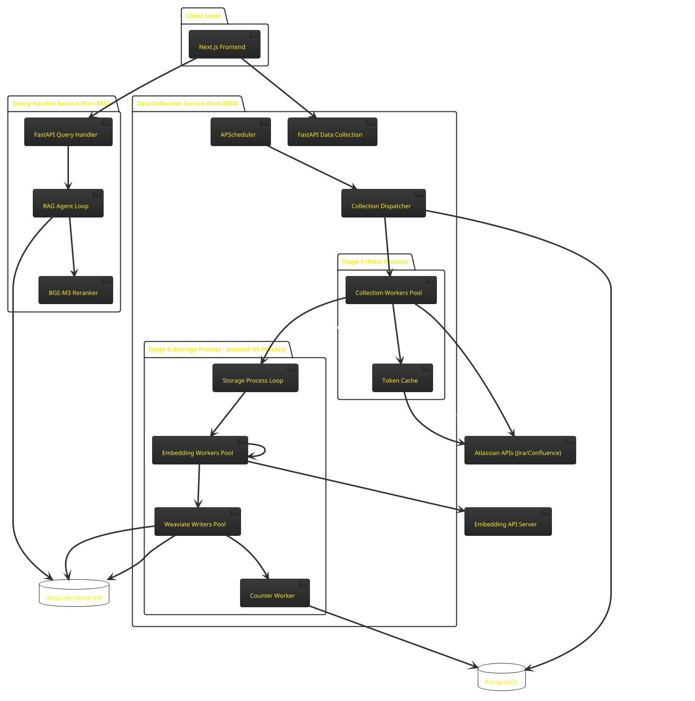
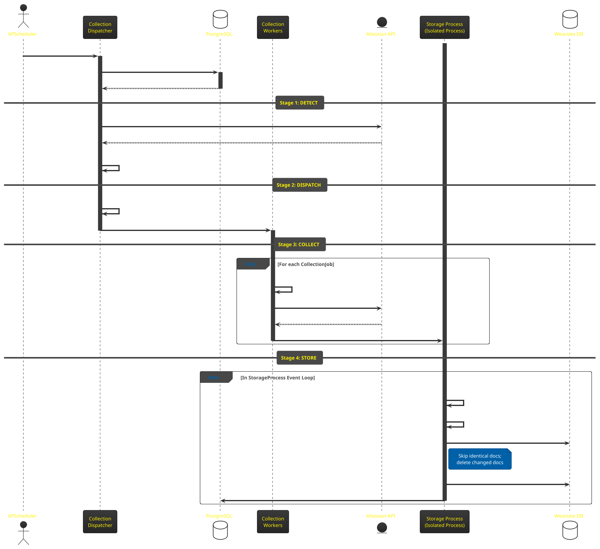
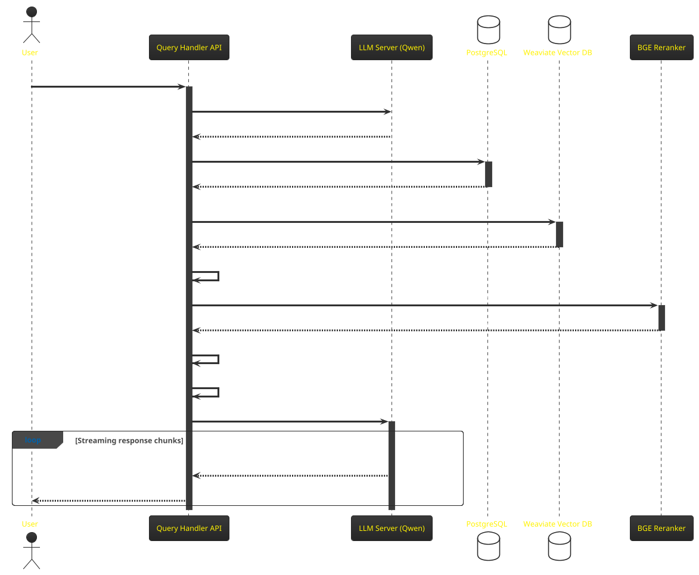

# Jieumchat: PlantUML System Diagrams

This document contains the official **PlantUML** source code for Jieumchat's backend architecture and pipeline flows. You can copy these code blocks directly into any PlantUML viewer (such as [PlantText](https://www.planttext.com/) or the VS Code PlantUML extension) to render and export them.

---

## 1. System Component & Architecture Diagram

---

## 2. Ingestion Sequence Diagram

---

## 3. Query Execution Sequence Diagram

